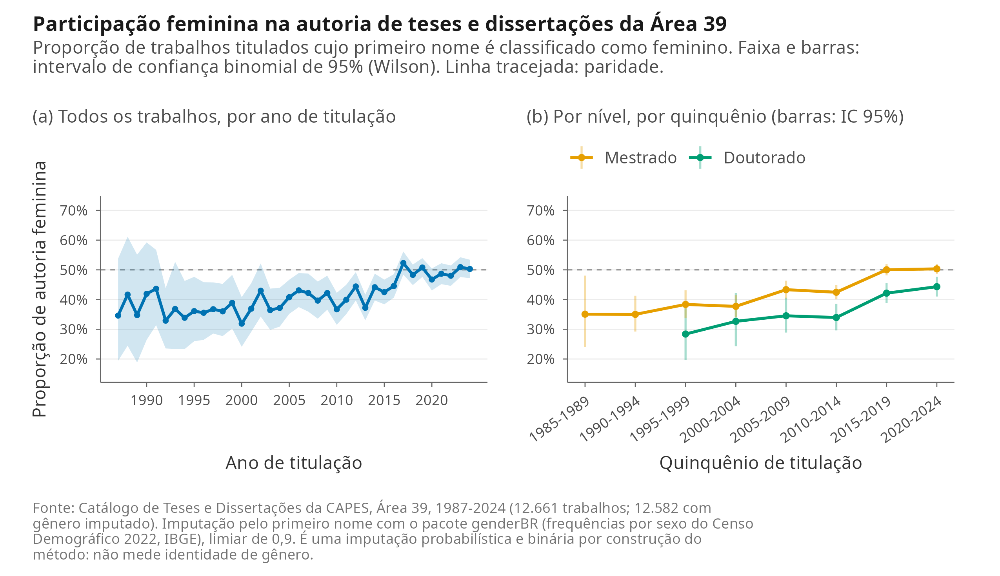
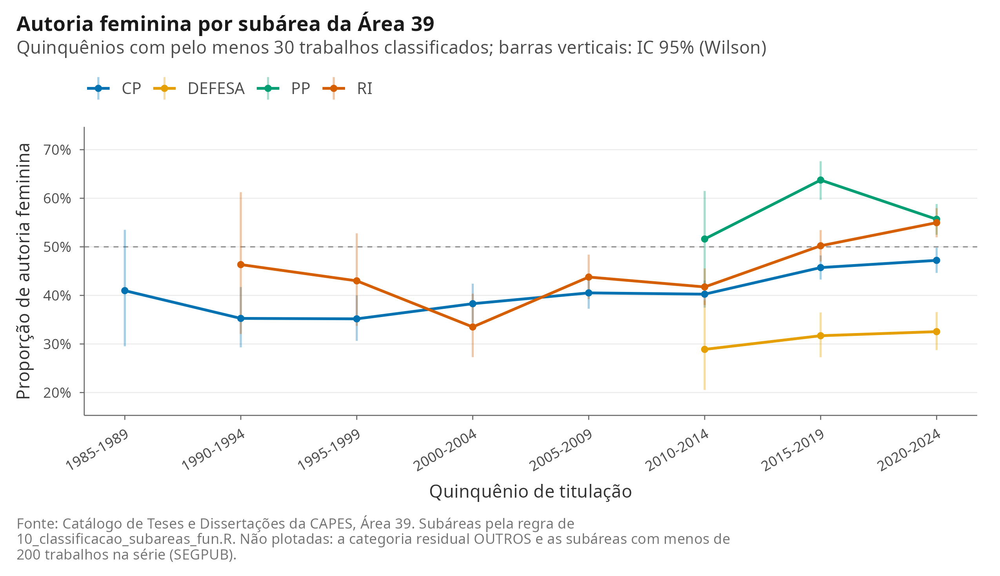

# Seção pronta para colar no `.qmd`

> **Como usar.** Três coisas antes de colar:
>
> 1. **Chunk de setup** — acrescentar uma linha ao bloco `setup` do `.qmd`
>    (junto de `v_temp`, `v_sub` etc., por volta da linha 42):
>
>    ```r
>    v_gen <- readRDS(here::here("DADOS", "processed", "valores_inline_genero.rds"))
>    ```
>
> 2. **Referência** — acrescentar ao `referencias.bib` (não editei o arquivo):
>
>    ```bibtex
>    @Manual{meireles2026genderbr,
>      title  = {{genderBR}: Predict Gender from {Brazilian} First Names},
>      author = {Fernando Meireles},
>      year   = {2026},
>      note   = {R package version 1.4.0},
>      url    = {https://CRAN.R-project.org/package=genderBR},
>      doi    = {10.32614/CRAN.package.genderBR}
>    }
>    ```
>
> 3. **Figuras** — `FIGURAS/fig23_genero_temporal.png` (corpo) e
>    `FIGURAS/fig23b_genero_subarea.png` (apêndice). Os nomes são fig23/fig23b
>    porque fig21 e fig22 já existem no projeto (concentração e quebras
>    estruturais). Se preferir renumerar, o script a gerar é
>    `SCRIPTS/22_genero_autoria.R`.
>
> Todos os números abaixo entram por `` `r ` `` a partir de
> `DADOS/processed/valores_inline_genero.rds`. Nenhum está escrito à mão.
>
> **Sugestão de posição:** logo após a §4.4 (subáreas) e antes da dinâmica
> espacial, ou ao final da seção de resultados descritivos. O texto pressupõe
> que a composição por subárea já foi apresentada.

---

## Composição de Gênero da Autoria de Teses e Dissertações

A expansão da pós-graduação da Área 39 pode ser lida também pela composição de quem a atravessa. O catálogo da CAPES não registra sexo ou gênero dos discentes, mas registra o nome completo, o que permite uma imputação probabilística a partir do primeiro nome. Aplicando o pacote `genderBR` [@meireles2026genderbr] aos `r fmt_int(v_gen$n_trabalhos)` trabalhos titulados entre `r v_gen$ano_inicio` e `r v_gen$ano_fim`, foi possível atribuir gênero a `r fmt_int(v_gen$n_classificado)` deles, ou `r fmt_pct(v_gen$taxa_classificacao, 1)` do total; `r fmt_int(v_gen$n_nao_classificado)` nomes permaneceram sem classificação. A cobertura é praticamente constante ao longo da série: entre quinquênios, a taxa de classificação varia de `r fmt_pct(v_gen$taxa_min_quinquenio, 1)` a `r fmt_pct(v_gen$taxa_max_quinquenio, 1)`, uma amplitude de `r fmt_num(v_gen$amplitude_taxa_pp, 1)` ponto percentual, e a regressão da taxa anual contra o ano indica deriva de `r fmt_num(v_gen$deriva_cobertura_pp_decada, 2)` ponto percentual por década. Isso importa porque uma cobertura que caísse ou subisse sistematicamente ao longo do tempo produziria, sozinha, uma tendência artificial na série. Não é o caso aqui.

A @fig-genero apresenta o resultado. A participação feminina na autoria sobe de `r fmt_pct(v_gen$fem_1987_1991, 1)` no primeiro quinquênio da série (`r fmt_int(v_gen$n_1987_1991)` trabalhos classificados em 1987--1991) para `r fmt_pct(v_gen$fem_2020_2024, 1)` no último (`r fmt_int(v_gen$n_2020_2024)` trabalhos em 2020--2024), uma variação de `r fmt_num(v_gen$variacao_pp, 1)` pontos percentuais. Na série inteira, a proporção feminina é de `r fmt_pct(v_gen$fem_geral, 1)`. Uma regressão logística da probabilidade de autoria feminina contra o ano de titulação estima uma razão de chances de `r fmt_num(v_gen$or_decada, 2)` por década (IC 95%: `r fmt_num(v_gen$or_decada_ic[1], 2)`--`r fmt_num(v_gen$or_decada_ic[2], 2)`), isto é, uma tendência de alta consistente e estatisticamente distinguível de zero. A leitura correta dessa tendência, porém, é de aproximação da paridade, não de sua superação: em `r v_gen$ano_fim` a proporção feminina foi de `r fmt_pct(v_gen$fem_ano_fim, 1)` (IC 95%: `r fmt_pct(v_gen$fem_ano_fim_ic[1], 1)`--`r fmt_pct(v_gen$fem_ano_fim_ic[2], 1)`), e em nenhum ano da série o intervalo de confiança ficou inteiramente acima de 50%. A maioria feminina aparece como estimativa pontual em `r v_gen$n_anos_maioria_fem_pontual` anos (`r paste(v_gen$anos_maioria_fem_pontual, collapse = ", ")`), sempre com incerteza compatível com a paridade. Não há, portanto, um ano de virada a ser anunciado.

{#fig-genero width=100%}

A desagregação por nível mostra que o avanço não é uniforme ao longo da carreira acadêmica. No conjunto da série, `r fmt_pct(v_gen$fem_nivel_total[["Mestrado"]], 1)` dos mestrados e `r fmt_pct(v_gen$fem_nivel_total[["Doutorado"]], 1)` dos doutorados foram defendidos por mulheres. O ponto de partida era semelhante nos dois níveis — entre 1987 e 1999, `r fmt_pct(v_gen$fem_mestrado_1987_1999, 1)` no mestrado e `r fmt_pct(v_gen$fem_doutorado_1987_1999, 1)` no doutorado — e o hiato se abriu com a expansão. Em 2020--2024, o mestrado alcança `r fmt_pct(v_gen$fem_mestrado_2020_2024, 1)` (IC 95%: `r fmt_pct(v_gen$fem_mestrado_2020_2024_ic[1], 1)`--`r fmt_pct(v_gen$fem_mestrado_2020_2024_ic[2], 1)`, portanto indistinguível da paridade), enquanto o doutorado fica em `r fmt_pct(v_gen$fem_doutorado_2020_2024, 1)` (IC 95%: `r fmt_pct(v_gen$fem_doutorado_2020_2024_ic[1], 1)`--`r fmt_pct(v_gen$fem_doutorado_2020_2024_ic[2], 1)`), abaixo dela com folga. A distância entre os dois níveis no último quinquênio é de `r fmt_num(v_gen$hiato_nivel_2020_2024_pp, 1)` pontos percentuais. Como o doutorado é o nível que alimenta a carreira docente, esse é o recorte com maior consequência para a composição futura do corpo de pesquisadores da área.

A composição interna da Área 39 explica parte da variação. Considerando toda a série, os trabalhos titulados em programas de políticas públicas têm `r fmt_pct(v_gen$fem_subarea[["PP"]], 1)` de autoria feminina, contra `r fmt_pct(v_gen$fem_subarea[["RI"]], 1)` em relações internacionais, `r fmt_pct(v_gen$fem_subarea[["CP"]], 1)` em ciência política estrita e `r fmt_pct(v_gen$fem_subarea[["DEFESA"]], 1)` em defesa e estudos estratégicos — uma diferença de `r fmt_num(100 * (v_gen$fem_subarea[["PP"]] - v_gen$fem_subarea[["DEFESA"]]), 1)` pontos percentuais entre os extremos. A subárea de segurança pública tem apenas `r fmt_int(v_gen$n_subarea_insuficiente)` trabalhos classificados em toda a série e não sustenta estimativa desagregada; não é reportada por subárea nem plotada. O recorte territorial só é possível de `r v_gen$regiao_periodo_inicio` em diante, porque a região da instituição não existe no layout de 1987--2012 do catálogo. No período `r v_gen$regiao_periodo_inicio`--`r v_gen$ano_fim`, a proporção feminina vai de `r fmt_pct(v_gen$fem_regiao[["CENTRO-OESTE"]], 1)` no Centro-Oeste a `r fmt_pct(v_gen$fem_regiao[["NORDESTE"]], 1)` no Nordeste, com Sudeste em `r fmt_pct(v_gen$fem_regiao[["SUDESTE"]], 1)` e Sul em `r fmt_pct(v_gen$fem_regiao[["SUL"]], 1)`; o Norte reúne apenas `r fmt_int(v_gen$n_regiao[["NORTE"]])` trabalhos classificados no período e sua estimativa é reportada com essa ressalva. A @fig-genero-subarea, no apêndice, traz a evolução por subárea em quinquênios.

O procedimento tem limites que precisam ficar explícitos. A inferência de gênero por nome é uma imputação probabilística construída a partir das frequências por sexo dos primeiros nomes no Censo Demográfico do IBGE (edição de `r v_gen$censo_ano`), tal como distribuídas pelo pacote `genderBR` [@meireles2026genderbr]; não é uma medida de identidade de gênero, e nenhum discente foi consultado sobre a sua. O método é binário por construção: classifica cada nome como feminino ou masculino, e por isso não capta pessoas trans nem pessoas não binárias, que ficam necessariamente subsumidas em uma das duas categorias ou entre as não classificadas. O erro não é distribuído de forma homogênea: nomes raros, nomes estrangeiros e nomes unissex são os casos difíceis, e são também os que concentram as não classificações — dos `r fmt_int(v_gen$n_nao_classificado)` trabalhos sem gênero atribuído, `r fmt_int(v_gen$motivos_nao_classificacao$n[v_gen$motivos_nao_classificacao$motivo == "nome fora da base do Censo"])` têm primeiro nome ausente da base do Censo e `r fmt_int(v_gen$motivos_nao_classificacao$n[v_gen$motivos_nao_classificacao$motivo == "nome unissex (probabilidade intermediária)"])` têm probabilidade intermediária, entre `r fmt_num(1 - v_gen$limiar, 1)` e `r fmt_num(v_gen$limiar, 1)`. A unidade de análise é o trabalho titulado, não a pessoa: uma mesma pessoa que fez mestrado e doutorado na área entra duas vezes. Onde o identificador de discente existe (`r v_gen$regiao_periodo_inicio`--`r v_gen$ano_fim`), os `r fmt_int(v_gen$n_trabalhos_2013_2024)` trabalhos correspondem a `r fmt_int(v_gen$n_pessoas_2013_2024)` pessoas distintas, e a proporção feminina calculada por pessoa (`r fmt_pct(v_gen$fem_pessoa_2013_2024, 1)`) difere da calculada por trabalho (`r fmt_pct(v_gen$fem_trabalho_2013_2024, 1)`) em menos de meio ponto percentual. Por fim, os registros de 1987--2012 vêm com o nome ora completo, ora com o sobrenome à frente; a rotina usa o primeiro elemento do nome que a base do Censo reconhece, e a série calculada apenas com o primeiro elemento, sem essa recuperação, dá `r fmt_pct(v_gen$fem_geral_sem_recuperacao, 1)` de autoria feminina no agregado, contra `r fmt_pct(v_gen$fem_geral, 1)` da série reportada. Os números desta seção devem ser lidos como estimativas com essas margens, e não como contagens exatas.

---

## Figura do apêndice

{#fig-genero-subarea width=100%}

---

## Correção obrigatória na seção de Dados

A frase atual da §3 (linha 157 do `.qmd`, no item **Indicadores institucionais**) é:

> Os microdados docentes não contêm sexo ou gênero; nenhuma dessas características é inferida por nome.

Ela se refere aos **docentes**, mas fica contraditória com a nova seção, que infere gênero por nome para os **discentes**. **Redação substituta exata** (a frase inteira, mantendo o resto do item intacto):

> Os microdados docentes não contêm sexo ou gênero, e nenhuma dessas características é inferida para os docentes. A única inferência por nome feita neste artigo está restrita aos discentes, na seção sobre a composição de gênero da autoria de teses e dissertações, onde o gênero é imputado do primeiro nome com o pacote `genderBR` e os limites do procedimento são declarados.

Se preferir uma versão mais curta:

> Os microdados docentes não contêm sexo ou gênero, e nenhuma dessas características é inferida para os docentes; a única inferência de gênero por nome feita no artigo é a dos discentes, apresentada com seus limites na seção correspondente.
