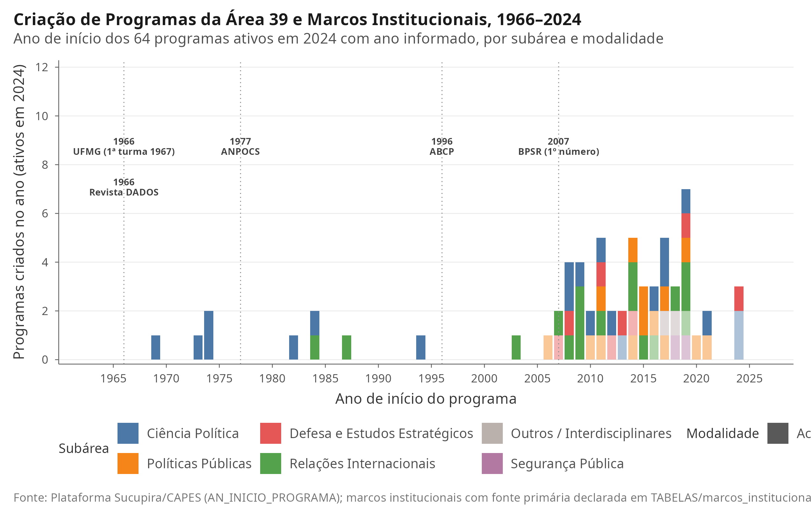
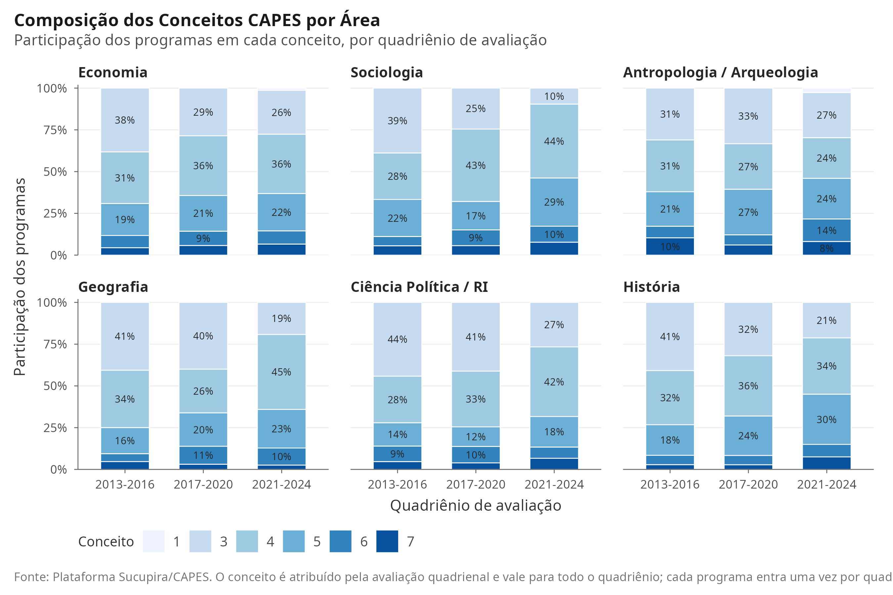
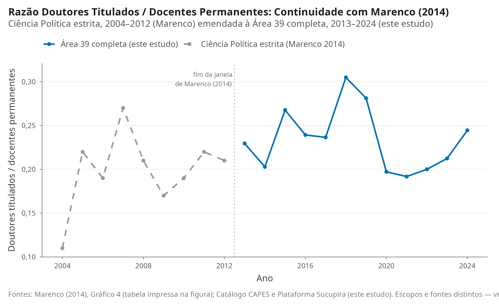
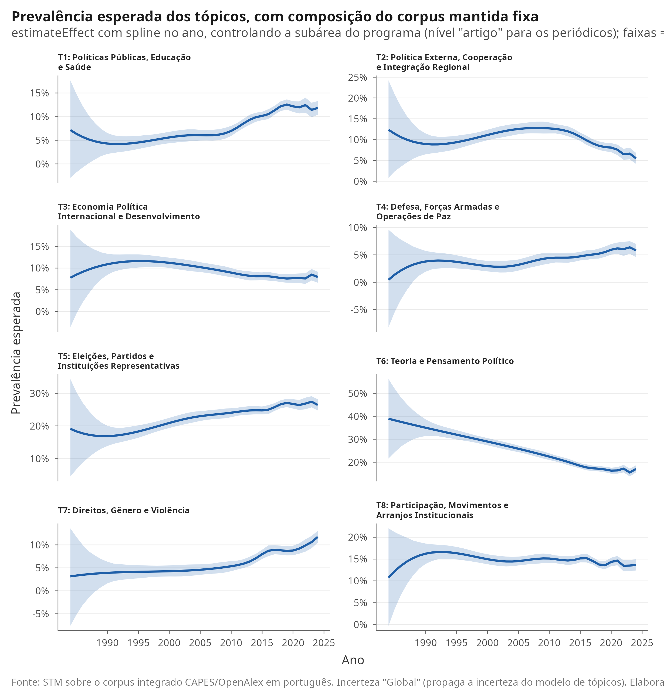

```{r setup, include=FALSE}
knitr::opts_chunk$set(
  echo = FALSE,
  warning = FALSE,
  message = FALSE,
  fig.align = "center",
  fig.width = 7,
  fig.height = 4.5,
  dpi = 300
)

# Carrega o ambiente reprodutível e tema de figuras
source(here::here("SCRIPTS", "00_setup.R"))

# Carrega valores calculados inline para garantir consistência total
v_temp <- readRDS(here::here("DADOS", "processed", "valores_inline_temporal.rds"))
v_geo  <- readRDS(here::here("DADOS", "processed", "valores_inline_geografia.rds"))
v_sub  <- readRDS(here::here("DADOS", "processed", "valores_inline_subareas.rds"))
v_stm  <- readRDS(here::here("DADOS", "processed", "valores_inline_stm.rds"))
tab_temp <- readRDS(here::here("DADOS", "processed", "tabela_series_temporais.rds"))
comp_ind <- read_csv(here::here("TABELAS", "tabela_comparacao_painel_integrado.csv"), show_col_types = FALSE)
comp_2024 <- comp_ind %>% filter(ano == max(ano, na.rm = TRUE))
comp_metricas <- read_csv(here::here("TABELAS", "tabela_comparacao_metricas_capes.csv"), show_col_types = FALSE)
v_marenco <- readRDS(here::here("DADOS", "processed", "valores_inline_marenco.rds"))
topicos_nomes <- readRDS(here::here("DADOS", "processed", "stm_topicos_nomes.rds"))
# Artefatos da rodada de correção 2026-09-02 (códigos de área, modalidade,
# concentração, quebras estruturais e validação da classificação de subáreas).
v_comp <- readRDS(here::here("DADOS", "processed", "valores_inline_comparacao.rds"))
v_conc <- readRDS(here::here("DADOS", "processed", "valores_inline_concentracao.rds"))
v_queb <- readRDS(here::here("DADOS", "processed", "valores_inline_quebras.rds"))
v_val  <- v_sub$validacao
comp_cagr <- read_csv(here::here("TABELAS", "tabela_comparacao_cagr.csv"), show_col_types = FALSE)
v_stm_ef <- readRDS(here::here("DADOS", "processed", "valores_inline_stm_efeitos.rds"))
v_stm_incl <- read_csv(here::here("TABELAS", "tabela_stm_inclinacoes_por_fonte.csv"), show_col_types = FALSE)

# Ordena as seis áreas pelo número de programas em 2024 e devolve a posição da
# Área 39, para o texto não precisar afirmar "a menor" nem "a maior" à mão.
prog24 <- sort(v_comp$programas_2024, decreasing = TRUE)
lista_areas <- function(x, sufixo = "") paste0(
  paste0(names(x), " (", format(unname(x), big.mark = "."), sufixo, ")"), collapse = ", ")
```

# Resumo {.unnumbered}

Este artigo analisa a trajetória histórica, a expansão institucional e a diversificação temática da Ciência Política no Brasil. Integra quatro fontes de dados administrativos e bibliométricos abertos: o Catálogo de Teses e Dissertações da CAPES (`r fmt_int(v_temp$total_titulos_cap)` trabalhos defendidos entre `r v_temp$primeiro_ano_titulos` e `r v_temp$ultimo_ano_titulos`), a Plataforma Sucupira, o OpenAlex e a documentação das associações científicas da área.

O Catálogo registra `r fmt_int(v_temp$total_titulos_cap)` títulos, com pico de `r fmt_int(v_temp$pico_titulos_val)` defesas em `r v_temp$pico_titulos_ano`, último ano da série. A Sucupira lista `r fmt_int(v_temp$total_programas_unicos)` programas únicos entre `r v_temp$primeiro_ano_ppg` e `r v_temp$ultimo_ano_ppg`, dos quais `r fmt_int(v_temp$max_programas_ano)` ativos em 2024, reunindo `r fmt_int(v_temp$vinculos_docentes)` vínculos programa-docente-ano e `r fmt_int(v_temp$docentes_unicos)` docentes. O OpenAlex fornece `r fmt_int(v_temp$total_artigos)` artigos de pesquisa até 2024 nos seis periódicos selecionados da área.

Os resultados mostram expansão da pós-graduação e desconcentração espacial: a participação do Sudeste caiu de `r fmt_num(v_geo$pct_sudeste_2013)`% em 2013 para `r fmt_num(v_geo$pct_sudeste_2024)`% em 2024. A Área 39 da CAPES (Ciência Política e Relações Internacionais) abriga hoje programas de ciência política, relações internacionais, políticas públicas, defesa e segurança pública: em 2024, `r fmt_num(v_sub$pct_cp_2024)`% dos títulos vieram de ciência política estrita, `r fmt_num(v_sub$pct_ri_2024)`% de relações internacionais, `r fmt_num(v_sub$pct_pp_2024)`% de políticas públicas, `r fmt_num(v_sub$pct_def_2024)`% de defesa e estudos estratégicos e `r fmt_num(v_sub$pct_segpub_2024)`% de segurança pública. Na comparação com cinco áreas irmãs, a Área 39 ocupa posição intermediária em escala: com `r fmt_int(v_comp$programas_2024[["Ciência Política / RI"]])` programas em 2024, é a `r v_comp$posicao_area39_programas_2024`ª de seis, à frente de Sociologia (`r fmt_int(v_comp$programas_2024[["Sociologia"]])`) e Antropologia/Arqueologia (`r fmt_int(v_comp$programas_2024[["Antropologia / Arqueologia"]])`). Foi também a que mais cresceu entre 2013 e 2024 (`r fmt_num(v_comp$var_programas_pct[["Ciência Política / RI"]], 0)`%) e a que tem a maior proporção de programas profissionais (`r fmt_num(v_comp$pct_prof_2024[["Ciência Política / RI"]])`%).

A modelagem estrutural de tópicos, estimada sobre o corpus em português com o número de tópicos escolhido por diagnóstico formal, identifica um único movimento que sobrevive ao controle da composição do corpus: a retração da teoria política. As demais mudanças temáticas aparecem nas médias, mas não se distinguem da incerteza quando se controlam a fonte e a subárea.

**Palavras-chave:** Ciência Política Brasileira; Institucionalização; Pós-Graduação; Diversificação Temática; Modelagem de Tópicos; CAPES.

---

# Introdução

Ao se completarem 60 anos desde a criação dos primeiros programas de pós-graduação em ciência política no país, na segunda metade da década de 1960, este é um momento oportuno para tratar a disciplina como uma construção coletiva. O aniversário permite perguntar como se formou a infraestrutura que sustenta a pesquisa hoje, onde ela se expandiu e quais agendas passaram a organizar o campo. A resposta a essa pergunta importa porque a narrativa corrente de expansão da ciência política brasileira pode estar, em boa medida, contando a história de campos limítrofes: parte do crescimento recente ocorreu em programas de políticas públicas, defesa e segurança abrigados na mesma área de avaliação da CAPES, não apenas em programas de ciência política estrita.

A institucionalização da Ciência Política como disciplina autônoma no Brasil constitui um processo expressivo de diferenciação acadêmica e consolidação científica [@leite2013autonomizacao; @marenco2014heels]. Inicialmente subordinada aos marcos intelectuais e institucionais do Direito, da Filosofia e da Sociologia nas décadas de 1950 e 1960, a área construiu sua identidade profissional a partir da fundação de centros pioneiros de pós-graduação e pesquisa no final dos anos 1960 e 1970 [@forjaz1997emergencia; @lamounier1989anos70]. Esse processo de autonomização exigiu uma demarcação clara de fronteiras institucionais e epistemológicas em relação às áreas irmãs.

Enquanto a Sociologia e a Antropologia cresceram muito no número de programas de doutorado e na capilaridade nacional (ancoradas, respectivamente, na macrossociologia, na teoria social crítica e na etnografia de campo), e a História e a Geografia expandiram-se fortemente pela vinculação à educação básica e às licenciaturas, a Ciência Política brasileira teve uma trajetória mais concentrada. Segundo o diagnóstico de @marenco2014heels, a área enfrentou uma expansão mais tardia de sua pós-graduação e de sua associação científica em relação aos pares (a ABCP surgiu apenas em 1996), mas buscou se diferenciar por uma crescente adoção de teorias de médio alcance (como o neoinstitucionalismo) e de métodos empíricos e quantitativos. Esse movimento a aproximou, em certa medida, da formalização analítica consolidada pela Economia acadêmica, mantendo, no entanto, o foco estrito nas instituições do Estado, no comportamento político e na dinâmica do poder.

Neste texto comemorativo, a trajetória da disciplina é examinada em torno de três eixos fundamentais:

1. **A dimensão institucional e de expansão:** a pós-graduação *stricto sensu*, sob a regulação e o fomento da CAPES e do CNPq, atuou como o principal instrumento de autonomização, padronização da formação e titulação de mestres e doutores [@capes2022relatorio];
2. **A dimensão espacial e federativa:** a superação paulatina do monopólio exercido pelo eixo Rio de Janeiro, São Paulo e Minas Gerais em direção a uma rede nacional de programas que hoje abrange `r v_geo$total_ufs_com_ppg_2024` Unidades da Federação;
3. **A dimensão metodológica e temática:** a resposta aos diagnósticos clássicos sobre o déficit de treinamento empírico formal [@soares2005calcanhar; @marenco2014heels] e a diversificação das agendas de pesquisa. A análise documental permite descrever essa pluralização; uma conclusão sobre mudança metodológica exigiria codificação explícita dos desenhos de pesquisa.

O objetivo deste artigo é fornecer uma análise empírica abrangente, sistemática e reprodutível da evolução da Ciência Política no Brasil. Diferentemente de revisões ensaísticas prévias, este trabalho apoia-se no censo completo de teses e dissertações da CAPES, nos microdados da Plataforma Sucupira e no universo de artigos de pesquisa publicados nos seis periódicos selecionados da área (*DADOS*, *Brazilian Political Science Review*, *Opinião Pública*, *Revista Brasileira de Ciência Política*, *Revista de Sociologia e Política* e *Lua Nova*). Três resultados centrais emergem dos dados. Primeiro, a Área 39 é hoje composta por apenas cerca de `r fmt_int(v_sub$pct_cp_2024)`% de títulos em ciência política estrita, o que relativiza a expansão da disciplina em relação aos campos limítrofes. Segundo, em comparação com as áreas irmãs, a Área 39 não é o menor sistema de pós-graduação, como a leitura corrente sugere: ocupa posição intermediária em escala, mas é a que mais cresceu na última década e a que mais recorre a programas profissionais. Terceiro, a modelagem de tópicos mostra a perda de dominância da teoria política e a ascensão das políticas públicas, das relações internacionais e dos direitos e gênero. O artigo contribui ao separar empiricamente, com dados administrativos completos e verificáveis, a escala do sistema, a intensidade da formação e a composição temática da área.

Os três eixos desdobram-se, na seção de resultados, em sete dimensões empíricas. O manuscrito organiza-se da seguinte forma: a segunda seção revisa a literatura sobre a sociologia da Ciência Política brasileira e as hipóteses de periodização disciplinar. A terceira seção detalha a estratégia de coleta, o *linkage* (ligação entre bases) e o protocolo exploratório obrigatório. A quarta seção apresenta os achados empíricos organizados em sete dimensões: expansão da pós-graduação, comparação com áreas irmãs, associações científicas, composição interna da Área 39, desconcentração regional, produção em periódicos e modelagem temática via *Structural Topic Model* (STM). A quinta seção discute as implicações desses resultados para a governança acadêmica e a autonomia disciplinar, seguida pelas conclusões e pelo apêndice de reprodutibilidade.

---

# Referencial Teórico: Autonomização, Gerações e Método

A literatura especializada na história da Ciência Política no Brasil identifica marcos geracionais e institucionais que balizam o desenvolvimento da disciplina.

## As Três Idades da Ciência Política Brasileira

Sintetizando os marcos de Forjaz [@forjaz1997emergencia] e de Lamounier [@lamounier1989anos70], a trajetória da disciplina pode ser organizada em três ciclos analíticos (@fig-tres-idades).

* **A Idade da Criação e da Filiação (décadas de 1960 e 1970):** estabelecimento dos primeiros programas de pós-graduação, com o programa da UFMG organizado institucionalmente em 1966 (recebendo a primeira turma do mestrado em 1967), seguido pelo IUPERJ (1969), pela USP (1971) e pela UFRGS (1973) [datas a verificar em fonte primária: ver `TABELAS/marcos_institucionais_pendentes.csv`]. O mesmo ano de 1966 viu o lançamento da revista *DADOS*, um dos periódicos de ciências sociais mais longevos do país. O foco analítico centrava-se na compreensão do autoritarismo, na estrutura corporativa do Estado e nas condições de transição democrática [@forjaz1997emergencia].
* **A Idade da Expansão Institucional (décadas de 1980 e 1990):** criação de novos programas, como o mestrado em ciência política e relações internacionais da UnB, iniciado em 1984 [verificar], e consolidação dos canais institucionais com a ANPOCS (1977) e a Associação Brasileira de Ciência Política (ABCP, 1996). A agenda de pesquisa deslocou-se para as instituições representativas da Nova República: sistemas eleitorais, partidos, processo decisório no Congresso Nacional e federalismo [@lamounier1989anos70; @amorimneto2003executivo].
* **A Idade da Profissionalização e Internacionalização (século XXI):** diversificação temática, crescente sofisticação analítica, busca por inserção internacional (marcada pelo lançamento da *BPSR* em 2007) e expansão para além das metrópoles tradicionais.

{#fig-tres-idades width=95%}

## A Pós-Graduação como Motor de Autonomização e o Contraste com Áreas Irmãs

@leite2013autonomizacao demonstram que a institucionalização da Ciência Política no Brasil não decorreu espontaneamente da graduação, mas foi impulsionada de cima para baixo pelo sistema de avaliação e fomento coordenado pela CAPES. A criação da Área 39 (Ciência Política e Relações Internacionais) no sistema nacional de avaliação conferiu ao campo critérios próprios de produtividade, representados sobretudo pelo *Qualis Periódicos*, e metas de titulação.

O formato dessa institucionalização fica mais nítido quando contrastado com as ciências sociais vizinhas. Segundo @marenco2014heels, embora a Ciência Política, a Sociologia e a Antropologia tenham iniciado seus programas de doutorado de forma quase simultânea nos anos 1970, a Ciência Política experimentou um atraso considerável na sua expansão. Até a virada do milênio, o volume de programas e de doutores formados na área era substancialmente inferior ao das áreas irmãs, gerando um "déficit de doutores" que retardou a fundação de novos centros, especialmente fora do eixo Sudeste. Além disso, diferentemente da Geografia e da História, cujos programas de pós-graduação cresceram impulsionados pela demanda por qualificação docente nas licenciaturas, a Ciência Política constituiu-se primordialmente como uma disciplina voltada à pesquisa avançada e ao ensino superior. Isso ajuda a explicar sua menor capilaridade inicial e seu alto grau de especialização.

## O Debate Metodológico e a Superação do "Calcanhar de Aquiles"

Em intervenção seminal, @soares2005calcanhar diagnosticou a fragilidade no treinamento em métodos empíricos e quantitativos nos programas de pós-graduação brasileiros, caracterizando-a como o *"calcanhar metodológico"* da área. @marenco2014heels analisou a institucionalização da ciência política a partir da expansão do sistema de pós-graduação e do processo de avaliação da CAPES, em comparação com a sociologia e a antropologia, e enumerou as fragilidades que persistem nessa trajetória. O diagnóstico teve efeito: entre a denúncia da carência e a oferta de formação, a área construiu, ao longo de duas décadas, uma infraestrutura de treinamento metodológico que não existia quando Soares escreveu.

A resposta institucional mais duradoura antecede o próprio diagnóstico. O Programa Intensivo em Metodologia Quantitativa e Qualitativa (MQ²) da UFMG foi fundado em 1999 no Programa de Pós-Graduação em Sociologia e no Centro de Pesquisas Quantitativas em Ciências Sociais da FAFICH, e realiza edições anuais em julho, na forma de cursos de extensão de curta duração; sua 26ª edição, em 2026, ofereceu 23 cursos, e o programa acumula mais de três mil participantes formados. Sua origem na sociologia e não na ciência política é significativa: a formação quantitativa chegou à Área 39 por uma porta lateral, compartilhada com uma área irmã, antes de ser demanda explícita da disciplina. O Programa de Pós-Graduação em Ciência Política da UFMG manteve escola própria entre 2017 e 2022 -- o MODUS, que em suas três primeiras edições ofertou 630 horas-aula com 31 professores de sete instituições e registrou mais de 750 inscrições -- e, encerrada essa experiência, voltou a operar em parceria com a sociologia no MQ² a partir de 2023.

A segunda iniciativa é de outra natureza, porque projeta a área para fora. A IPSA-USP Summer School on Concepts, Methods and Techniques in Political Science teve sua primeira edição em fevereiro de 2010, organizada pelo Departamento de Ciência Política da FFLCH-USP com o Centro de Estudos da Metrópole e o Núcleo de Estudos Comparados e Internacionais, e foi a primeira escola de verão da International Political Science Association no mundo. Sua trajetória acompanha, em escala menor, a curva que este artigo documenta para a pós-graduação: partiu de 87 participantes de dez países em 2010, atingiu 225 participantes de 17 países em 2016, foi interrompida pela pandemia e não teve edições em 2022, 2023 e 2026, com a 16ª edição anunciada para janeiro de 2027. A internacionalização da formação metodológica, portanto, não é uma trajetória ascendente contínua: é uma conquista que precisa ser sustentada.

Outras instituições seguiram o mesmo caminho -- a Escola de Inverno em Métodos, Conceitos e Teorias Sociais do IESP-UERJ, a Escola de Métodos do Instituto de Ciência Política da UnB e a Escola de Métodos Quantitativos da FGV-EAESP --, de modo que a oferta deixou de ser um monopólio de dois centros. A produção didática acompanhou a oferta de cursos, com manuais e artigos de método escritos no país e em português [@paranhos2013causalidade; @figueiredo2019metodos].

Os balanços empíricos disponíveis mostram um deslocamento real, embora parcial. @nicolau2017political, examinando 1.196 artigos de seis periódicos entre 1966 e 2015, registram que a análise de regressão passa de ausência completa antes de 1990 a 19% dos artigos em 2006--2015, mas que cerca de metade da produção recente se limita à estatística descritiva e que os métodos qualitativos permanecem restritos a entrevistas, presentes em apenas 5% dos textos. @figueiredo2021metodologias, sobre 3.409 resumos entre 1993 e 2019, observam que técnicas quantitativas e qualitativas cresceram a taxas equivalentes, o que sugere sofisticação geral e não substituição de um repertório por outro. @neiva2015revisitando revisita o diagnóstico de Soares para o conjunto das ciências sociais brasileiras, e @albuquerque2022obscuridade deslocam a questão do treinamento para a transparência: saber qual método foi usado depende de o texto o relatar. Por fim, @sainz2024separate, analisando 1.849 teses e dissertações de onze programas entre 2013 e 2020, encontram que a estrutura metodológica espelha a estrutura temática -- cada comunidade temática opera com seu próprio repertório, em "mesas separadas".

Esse último achado dialoga diretamente com o que este artigo documenta. Se a Área 39 abriga hoje, sob a mesma área de avaliação, comunidades tão distintas quanto a ciência política estrita, as relações internacionais, as políticas públicas e a defesa, e se boa parte dessa expansão se dá na modalidade profissional, então falar de um "calcanhar metodológico" da área supõe uma unidade que talvez não exista mais. A pergunta pertinente deixa de ser se a ciência política brasileira superou sua carência metodológica e passa a ser em quais de suas comunidades internas, e a que ritmo, isso ocorreu. Os dados deste artigo não medem método -- os resumos permitem observar temas, não desenhos de pesquisa --, e essa é uma limitação que a seção de discussão retoma.

---

# Dados e Estratégia Metodológica

Em estrita observância aos padrões de transparência e reprodutibilidade, este estudo baseia-se em dados abertos estruturados a partir de quatro fontes:

1. **Catálogo de Teses e Dissertações da CAPES (1987--2024):** registros de trabalhos de conclusão vinculados à Área 39 (Ciência Política e Relações Internacionais), capturando título, resumo, autor, orientador, instituição, UF e páginas. A identificação da área usou o código de área de conhecimento CNPq no layout 1987--2012 e, no layout 2013--2024, a área de avaliação administrativa (`NM_AREA_AVALIACAO`) declarada no próprio catálogo, com o cruzamento por código de programa da Plataforma Sucupira, restrito ao mesmo ano-base, como checagem de consistência (os dois critérios discordam em `r fmt_int(v_temp$n_discordantes_area39)` registro); uma auditoria de integridade eliminou os registros que não pertenciam efetivamente à área (`r fmt_int(v_temp$n_excluidos_area39)` registros, equivalentes a `r fmt_num(v_temp$pct_excluidos_area39)`% do total), restando `r fmt_int(v_temp$total_titulos_cap)` registros válidos no período analisado. No layout 2013--2024, o ano da série (`AN_BASE`) coincide com o ano da data de defesa em todos os registros com data válida.
2. **Plataforma Sucupira / Cursos e Docentes (2013--2024):** informações anuais sobre programas e corpo docente da Área 39, com `r fmt_int(v_temp$total_programas_unicos)` programas únicos observados no período (dos quais `r fmt_int(v_temp$max_programas_ano)` ativos em `r v_temp$max_programas_ano_ano`), `r fmt_int(v_temp$vinculos_docentes)` vínculos programa-docente-ano correspondentes a `r fmt_int(v_temp$docentes_unicos)` docentes identificados de forma única, conceitos CAPES e distribuição territorial.
3. **Produção Bibliográfica em Periódicos (OpenAlex, 1977--2024):** corpus de `r fmt_int(v_temp$total_artigos)` artigos de pesquisa publicados nas seis revistas selecionadas como canais da Ciência Política brasileira (*DADOS*, *BPSR*, *Opinião Pública*, *RBCP*, *Revista de Sociologia e Política* e *Lua Nova*). A seleção priorizou periódicos de longa duração e cobertura contínua no OpenAlex, os mais citados na literatura sobre a disciplina; os resultados dependem desse conjunto escolhido. Foram excluídos editoriais, resenhas, erratas e itens de *front matter* (material de abertura, como apresentações e expeditos), bem como os anos 2025--2026, cuja indexação ainda é incompleta. A cobertura do OpenAlex é desigual entre periódicos (a *DADOS*, por exemplo, só aparece a partir de 1977 e a *Opinião Pública* a partir de 1993), o que condiciona a leitura dos anos iniciais da série.
4. **Comparação institucional (CAPES/Sucupira, 1987--2024):** para as áreas de avaliação 28 (Economia), 34 (Sociologia), 35 (Antropologia e Arqueologia), 36 (Geografia), 39 (Ciência Política e Relações Internacionais) e 40 (História), foram harmonizados os registros do Catálogo de Teses e Dissertações e os microdados anuais de programas e docentes. A comparação produz contagens de títulos por nível, programas, docentes, IES, UFs, conceitos CAPES, distribuição regional, concentração institucional e indicadores normalizados na janela comum 2013--2024. As áreas de avaliação não são tratadas como disciplinas perfeitamente equivalentes.

## Protocolo Exploratório e Limpeza de Dados (Camada 2)

Antes de qualquer modelagem, os dados foram auditados safra a safra conforme o protocolo de programação científica:

* **Filtro da Área 39:** a base da CAPES combina dois layouts históricos, o que exigiu âncoras distintas para identificar a área. Nos anos 1987--2012, usou-se o código de área de conhecimento CNPq (7090 para ciência política); nos anos 2013--2024, a área de avaliação administrativa declarada no catálogo (`NM_AREA_AVALIACAO`), com o código de programa cruzado com a lista oficial de programas da Área 39 da Plataforma Sucupira como checagem de consistência. O procedimento eliminou os registros de programas de outras áreas capturados pelo filtro textual de extração.
* **Padronização Textual:** remoção de ruídos de codificação e transliteração para ASCII em `r fmt_int(v_stm$corpus_bruto_n)` resumos combinados, dos quais `r fmt_int(v_stm$modelo_docs)` em português entram na modelagem de tópicos (ver seção 4.7).
* **Validação de Chaves:** teste de unicidade em identificadores de programas (`cd_programa_ies`) e deduplicação de artigos pela chave única da obra no OpenAlex (`id_openalex`), com exclusão de obras sem identificador válido.
* **Tratamento de Faltantes e layouts históricos:** a CAPES publicou os registros de 1987--2012 e de 2013--2024 em layouts distintos. As colunas `ano_base` e `an_base`, assim como `area_avaliacao` e `nm_area_avaliacao`, foram harmonizadas em chaves únicas. O procedimento preserva os 38 anos-base da série de títulos (1987--2024), evita excluir inadvertidamente o layout antigo e explicita registros não identificados.
* **Comparação entre áreas:** a classificação das áreas irmãs usa prioritariamente códigos/áreas administrativas do catálogo e dos arquivos Sucupira; o nome do programa é utilizado somente como fallback. Na janela 2013--2024, os indicadores de títulos são ligados aos programas ativos e ao corpo docente da Sucupira por ano, sem interpretar essa ligação como medida de produtividade individual.
* **Indicadores institucionais:** programas são deduplicados por `CD_PROGRAMA_IES` em cada ano e docentes por `ID_PESSOA` em cada área-ano. Conceitos são descritos em sua escala original e não convertidos em ranking entre áreas. Os microdados docentes não contêm sexo ou gênero; nenhuma dessas características é inferida por nome.

As três rodadas de auditoria a que a base foi submetida, incluindo os erros encontrados e corrigidos, estão descritas no apêndice.

---

# Resultados Empíricos

Esta seção percorre sete dimensões da trajetória da área: a expansão da pós-graduação, a comparação com áreas irmãs, as associações científicas, a composição interna da Área 39, a desconcentração regional, a produção em periódicos e a evolução temática.

## A Expansão da Pós-Graduação

A primeira dimensão da institucionalização é a formação de mestres e doutores. A @fig-titulos mostra, em linhas separadas, como os dois níveis evoluíram anualmente entre 1987 e 2024. Essa distinção é importante porque o mestrado constitui a principal porta de entrada da formação stricto sensu, enquanto o doutorado sinaliza a capacidade de reprodução e pesquisa avançada do campo.

{#fig-titulos width=95%}

A série mostra a diferença persistente de escala entre os níveis. O mestrado permaneceu acima do doutorado em todos os anos observados, enquanto ambos cresceram no período recente. Em conjunto, foram `r fmt_int(v_temp$total_titulos_cap)` trabalhos no período. O volume total passou de `r fmt_int(tab_temp$titulos[tab_temp$ano==1987])` títulos em 1987 para `r fmt_int(v_temp$pico_titulos_val)` em 2024, ano de maior número de registros, no fim da série e possivelmente subestimado pela defasagem de registro. Dois movimentos da série merecem nota: a queda acentuada entre 2019 e 2020, provável efeito da pandemia sobre o calendário de defesas e do registro, e a retomada nos anos seguintes. Esses dados descrevem uma expansão observada, mas não permitem atribuí-la isoladamente a uma política específica.

Paralelamente, a @fig-ppgs documenta o crescimento no número de programas em funcionamento e das instituições de ensino superior (IES) que abrigam programas da área.

{#fig-ppgs width=95%}

O número de programas observados passou de `r fmt_int(tab_temp$programas_unicos[tab_temp$ano==2013])` em 2013 para `r v_temp$max_programas_ano` em 2024, distribuídos por `r v_geo$total_ufs_com_ppg_2024` Unidades da Federação. Desses `r v_temp$max_programas_ano` programas ativos em 2024, `r fmt_int(v_temp$n_programas_prof_2024)` (`r fmt_num(v_temp$pct_programas_prof_2024)`%) são de modalidade profissional, contra `r fmt_int(v_temp$n_programas_prof_2013)` em 2013: parte relevante da expansão recente é expansão de mestrados e doutorados profissionais, e não da formação acadêmica no formato tradicional. No painel comparativo, a Ciência Política/RI passou de `r fmt_int(v_comp$programas_2013[["Ciência Política / RI"]])` para `r fmt_int(v_comp$programas_2024[["Ciência Política / RI"]])` programas entre 2013 e 2024, um crescimento de `r fmt_num(v_comp$var_programas_pct[["Ciência Política / RI"]], 0)`%, maior que o de qualquer área irmã (a Geografia cresceu `r fmt_num(v_comp$var_programas_pct[["Geografia"]], 0)`%, a História `r fmt_num(v_comp$var_programas_pct[["História"]], 0)`% e a Sociologia não cresceu; @fig-ppgs-comparada). A instituição com maior volume acumulado de defesas no Catálogo CAPES é a `r v_geo$top_ies_nome`, responsável por `r fmt_int(v_geo$top_ies_n)` trabalhos de conclusão (o IUPERJ, instituto da UCAM, aparece separado na base; se fundidos, os totais seguem abaixo dos da USP).

### O Tamanho da Ciência Política Frente às Áreas Irmãs

Embora a trajetória própria da Ciência Política evidencie uma curva ascendente, a comparação com as disciplinas vizinhas nas Ciências Humanas e Sociais redimensiona esse crescimento, mas não da forma que a leitura mais intuitiva sugeriria. A imagem corrente é a de uma área pequena diante das irmãs. Os dados da Plataforma Sucupira, lidos com os códigos corretos de área de avaliação, não sustentam essa imagem em número de programas: em 2024 a Área 39 é a `r v_comp$posicao_area39_programas_2024`ª de seis, com `r fmt_int(v_comp$programas_2024[["Ciência Política / RI"]])` programas, atrás de `r lista_areas(prog24[1:3])` e à frente de `r lista_areas(prog24[5:6])` (@fig-ppgs-comparada). A área é pequena em outra dimensão, a territorial: está presente em `r fmt_int(v_comp$ufs_2024[["Ciência Política / RI"]])` unidades da federação, a menor cobertura das seis, contra `r fmt_int(v_comp$ufs_2024[["Geografia"]])` da Geografia e `r fmt_int(v_comp$ufs_2024[["História"]])` da História.

A taxa de crescimento entre 1987 e 2024 (`r fmt_num(comp_metricas$crescimento_relativo[comp_metricas$area_nome=="Ciência Política / RI"]*100, 0)`%, contra `r fmt_num(comp_metricas$crescimento_relativo[comp_metricas$area_nome=="História"]*100, 0)`% na História) é pouco informativa, porque a base de 1987 é quase nula (`r comp_metricas$titulos_primeiro_ano[comp_metricas$area_nome=="Ciência Política / RI"]` títulos) e o Catálogo é reconhecidamente incompleto naquele ano. Taxas compostas por década dizem mais: entre 2015 e 2024 a Área 39 cresceu `r fmt_num(100*comp_cagr$cagr[comp_cagr$janela=="2015-2024" & comp_cagr$area_nome=="Ciência Política / RI"], 1)`% ao ano em títulos, contra `r fmt_num(100*comp_cagr$cagr[comp_cagr$janela=="2015-2024" & comp_cagr$area_nome=="História"], 1)`% na História e `r fmt_num(100*comp_cagr$cagr[comp_cagr$janela=="2015-2024" & comp_cagr$area_nome=="Sociologia"], 1)`% na Sociologia. Em programas, a expansão de 2013 a 2024 foi a maior das seis áreas (`r fmt_num(v_comp$var_programas_pct[["Ciência Política / RI"]], 0)`%).

A @fig-ppgs-comparada apresenta o número de programas ativos na Plataforma Sucupira na última década; o volume de titulações, desagregado por nível, é retomado adiante na @fig-niveis-comparada.

{#fig-ppgs-comparada width=95%}

{#fig-conceitos width=95%}

Em 2024, a Ciência Política e Relações Internacionais contava com `r fmt_int(v_comp$programas_2024[["Ciência Política / RI"]])` programas e `r fmt_int(v_comp$docentes_perm_2024[["Ciência Política / RI"]])` docentes permanentes. Na comparação, a História possuía `r fmt_int(v_comp$programas_2024[["História"]])` programas e `r fmt_int(v_comp$docentes_perm_2024[["História"]])` docentes permanentes, a Geografia `r fmt_int(v_comp$programas_2024[["Geografia"]])` e `r fmt_int(v_comp$docentes_perm_2024[["Geografia"]])`, a Economia `r fmt_int(v_comp$programas_2024[["Economia"]])` e `r fmt_int(v_comp$docentes_perm_2024[["Economia"]])`, a Sociologia `r fmt_int(v_comp$programas_2024[["Sociologia"]])` e `r fmt_int(v_comp$docentes_perm_2024[["Sociologia"]])`, e a Antropologia/Arqueologia `r fmt_int(v_comp$programas_2024[["Antropologia / Arqueologia"]])` e `r fmt_int(v_comp$docentes_perm_2024[["Antropologia / Arqueologia"]])`. O corpo docente é contado na categoria permanente, que é a base do cálculo dos indicadores da própria avaliação da CAPES; incluir colaboradores e visitantes elevaria todos os números sem mudar a ordenação.

A diferença mais nítida entre as áreas não é o tamanho, e sim a modalidade. A Área 39 tem `r fmt_num(v_comp$pct_prof_2024[["Ciência Política / RI"]])`% de programas profissionais, a maior proporção das seis, contra `r fmt_num(v_comp$pct_prof_2024[["Economia"]])`% na Economia, `r fmt_num(v_comp$pct_prof_2024[["História"]])`% na História, `r fmt_num(v_comp$pct_prof_2024[["Geografia"]])`% na Geografia e nenhum programa profissional em Sociologia e em Antropologia/Arqueologia. Em 2013 essa proporção era de `r fmt_num(v_comp$pct_prof_2013[["Ciência Política / RI"]])`%. A Área 39 tinha ainda `r fmt_num(comp_2024$docentes_por_programa[comp_2024$area_nome == "Ciência Política / RI"])` docentes permanentes por programa, contra `r fmt_num(comp_2024$docentes_por_programa[comp_2024$area_nome == "Sociologia"])` na Sociologia, `r fmt_num(comp_2024$docentes_por_programa[comp_2024$area_nome == "Economia"])` na Economia, `r fmt_num(comp_2024$docentes_por_programa[comp_2024$area_nome == "Geografia"])` na Geografia e `r fmt_num(comp_2024$docentes_por_programa[comp_2024$area_nome == "História"])` na História: programas menores, em média, que os das áreas irmãs. Os conceitos CAPES não são comparados por média entre áreas, porque a escala é ordinal e as distribuições são distintas; a @fig-conceitos apresenta a composição de cada área, e os programas com conceito "A", atribuído a cursos novos, ficam fora do denominador.

A leitura dominante sobre a área precisa, portanto, ser desdobrada em duas afirmações distintas. A Área 39 não é o menor sistema de pós-graduação entre as ciências sociais brasileiras: em programas, é intermediária, e cresce mais depressa que qualquer das áreas comparadas. O que ela tem de menor é a capilaridade territorial e o tamanho médio dos programas, e o que tem de distintivo é o peso da formação profissional. A hipótese institucional corrente, de que a Ciência Política se desenvolveu como campo de pesquisa estrita enquanto História e Geografia se expandiram pela demanda das licenciaturas, continua plausível para explicar a diferença de cobertura territorial, mas não é testada diretamente pelos dados deste artigo.

### Formação por nível e intensidade institucional

A comparação por nível ajuda a distinguir a expansão dos programas do simples crescimento do volume agregado. A @fig-niveis-comparada separa mestrados e doutorados na janela comum de 2013 a 2024. Já a @fig-intensidade-comparada relaciona títulos registrados a programas ativos, indicador descritivo de intensidade de formação, e não de produtividade ou qualidade.

{#fig-niveis-comparada width=95%}

{#fig-intensidade-comparada width=95%}

A utilidade desses indicadores é comparativa e não classificatória: uma área pode apresentar mais títulos por programa porque possui maior participação de mestrados profissionais, maior fluxo de estudantes ou diferentes durações e padrões de registro. Eles informam a escala e a estrutura da formação, enquanto a avaliação de qualidade requer dados de trajetória dos egressos, produção, financiamento e critérios da avaliação quadrienal.

### Validação Externa: Continuidade com Marenco (2014)

Os dados deste estudo podem ser cotejados com os apresentados por @marenco2014heels, que documentou a expansão da pós-graduação em Ciência Política a partir de relatórios da CAPES até 2012-2013. As séries não são diretamente substituíveis: o escopo de @marenco2014heels é a Ciência Política estrita, com contagens cumulativas de cursos aprovados historicamente, enquanto este estudo cobre a Área 39 completa (incluindo Relações Internacionais, Políticas Públicas e Defesa e Segurança) com programas ativos em cada ano, segundo a Plataforma Sucupira. Os valores atribuídos a @marenco2014heels foram lidos das figuras do próprio artigo, com as tabelas de valores impressas nos gráficos, porque o banco de replicação do autor não respondeu em nenhuma das tentativas de acesso. Ainda assim, três pontos de contato sustentam a validade externa dos dados aqui reunidos. Primeiro, em 2013, @marenco2014heels reporta `r fmt_int(v_marenco$marenco_ma_2013)` cursos de mestrado e `r fmt_int(v_marenco$marenco_phd_2013)` de doutorado aprovados cumulativamente em Ciência Política estrita, contra `r fmt_int(v_marenco$area39_ma_2013)` cursos de mestrado acadêmico e `r fmt_int(v_marenco$area39_phd_2013)` de doutorado acadêmico ativos na Área 39 completa segundo a Sucupira (a contagem exclui os `r fmt_int(v_marenco$area39_mp_2013)` mestrados profissionais existentes na área em 2013, ausentes do escopo de Marenco). Os valores são da mesma ordem de grandeza e na direção esperada: mais doutorado pela área mais ampla, menos mestrado pelo critério de "ativo" em vez de "aprovado historicamente". Segundo, o número de unidades federativas com doutorado é praticamente idêntico, embora medido em anos distintos: `r fmt_int(v_marenco$marenco_estados_phd_2010)` em `r v_marenco$marenco_ano_estados` (Ciência Política estrita, Marenco) contra `r fmt_int(v_marenco$area39_estados_phd_2013)` em `r v_marenco$este_ano_estados` (Área 39 completa, este estudo) — os mesmos seis estados mais o Paraná; em 2024 são `r fmt_int(v_marenco$area39_estados_phd_2024)`. Terceiro, e mais informativo, a razão entre doutores titulados e docentes permanentes, que @marenco2014heels reporta subindo de `r fmt_num(v_marenco$marenco_ratio_2004, 2)` em 2004 para `r fmt_num(v_marenco$marenco_ratio_2012, 2)` em 2012, emenda quase sem descontinuidade com a mesma razão calculada para a Área 39 completa a partir de 2013 (`r fmt_num(v_marenco$area39_ratio_2013, 2)`), que chega a `r fmt_num(v_marenco$area39_ratio_2024, 2)` em 2024 (@fig-marenco-continuidade). A convergência de duas bases construídas com fontes e recortes distintos é um teste de validade externa que estes dados administrativos passam. O achado substantivo dessa série é a estagnação: uma regressão simples da razão sobre o ano entre 2013 e 2024 estima uma variação anual de `r fmt_num(v_marenco$tendencia_ratio_coef, 3)` (IC de 95%: `r fmt_num(v_marenco$tendencia_ratio_ic_inf, 3)` a `r fmt_num(v_marenco$tendencia_ratio_ic_sup, 3)`). O número de programas dobrou no período; a intensidade de formação doutoral por docente permanente, não.

{#fig-marenco-continuidade width=95%}

## As Associações Científicas e a Escala dos Encontros

A comparação entre as áreas também pode ser feita pela infraestrutura associativa que cada campo construiu para circular a produção. Cada disciplina conta com uma associação nacional que organiza o encontro periódico da área: a ANPOCS (1977, encontro anual), guarda-chuva da pós-graduação em ciências sociais; a ABCP (1996, encontros bienais), da ciência política; a SBS (1950), da sociologia; a ABA (1955), da antropologia; a ANPUH (1961), da história; a ANPEC (1973), da economia; e a ANPEGE (1994, encontros bienais), da geografia. A idade das associações espelha a cronologia descrita na seção anterior: as disciplinas mais antigas constituíram suas entidades nas décadas de 1950 e 1960, enquanto a ciência política só ganhou associação própria em 1996, no ciclo de expansão da área.

A métrica mais consistente disponível para comparar a vitalidade dos encontros é o fluxo de trabalhos, embora cada associação publique indicadores distintos (inscritos, credenciados, submetidos, aprovados ou publicados). A @fig-assoc apresenta as séries com dados publicados: ANPOCS (propostas recebidas e aprovadas, 2005--2017), ANPEGE (trabalhos aceitos, 1995--2023), ANPEC (submetidos e aprovados, 2007--2017) e ANPUH (trabalhos inscritos, 1991--2007).

{#fig-assoc width=100%}

Os dados revelam ordens de grandeza distintas. A ANPOCS recebeu entre 1.655 e 2.234 propostas por ano entre 2005 e 2017, aprovando de 324 a 880, o que corresponde a uma taxa de aprovação de 16% a 44%. A ANPEGE partiu de 114 trabalhos em 1995 e alcançou 1.642 em 2019 e 2.074 submetidos em 2023, com a estrutura do evento saltando de 10 eixos temáticos para 75 grupos de trabalho. A ANPEC recebeu entre 618 e 958 artigos por ano no período 2007--2017, aprovando cerca de 30%, e expandiu o número de aprovados de 108 em 2001 para cerca de 320 em 2023--2024 e 303 em 2025. A ANPUH registrou 2.400 trabalhos em 2005 e cerca de 2.700 em 2007, e seus simpósios nacionais reuniram de 6.000 a 8.000 participantes entre 2009 e 2013, a maior escala entre as áreas comparadas (o dado de 2013 é estimativa pré-evento).

A escala dos públicos confirma o gradiente, com as ressalvas de métrica já indicadas. As reuniões da ABA passaram de 1.117 participantes em 2010 para um pico de 3.761 em 2014, com 83 grupos de trabalho, e cerca de 2.800 inscritos em 2024. Os congressos da SBS reuniram de 250 participantes em 1997 a 2.360 em 2015 e 2.306 em 2019. O Encontro Anual da ANPOCS, medido por inscritos presentes, passou de 774 em 2001 para 1.641 em 2008 e oscilou entre cerca de 1.200 e 1.500 na década de 2010, com 1.193 credenciados na fase presencial de 2024.

A comparação entre associações é a mais frágil deste artigo, e por uma razão de medida: cada entidade publica um indicador diferente (inscritos, credenciados, presentes, propostas, submetidos, aprovados) e as fontes variam de relatórios de gestão a notícias de imprensa. Comparar inscritos de uma com credenciados de outra induz a erro. Com essa ressalva, a ordem de grandeza dos encontros não coloca a ciência política em último lugar: na edição mais recente com dado disponível, a ABCP registrou 1.722 inscritos, número acima dos 1.193 credenciados da ANPOCS em 2024 e dos cerca de 1.700 participantes do congresso da SBS em 2023, e abaixo dos cerca de 2.800 da ABA e dos cerca de 3.800 da ANPUH. Os encontros da ABCP receberam 764 trabalhos em 2008, 963 submissões em 2012 (502 aprovadas, 756 participantes) e 1.068 trabalhos em 2024. A leitura defensável é que o encontro bienal da disciplina está abaixo do porte dos das duas maiores áreas comparadas e em patamar semelhante ao das demais, e não que a área mobilize a menor escala do conjunto. A @fig-assoc-participantes resume a escala de participantes na edição mais recente com dado disponível, evidenciando a posição da ABCP no conjunto.

Os encontros de 2025 e 2026 confirmam que a estrutura dos eventos continua a crescer, embora os balanços quantitativos realizados dessas edições ainda não tenham sido publicados. O 49º Encontro da ANPOCS (Campinas, 2025) abriu 68 grupos de trabalho e 29 seminários de pesquisa, com cerca de 1.200 participantes previstos antes do evento. O 15º Encontro da ABCP (Belém, 2026) organizou 18 áreas temáticas, o 33º Simpósio Nacional de História (Belo Horizonte, 2025) reuniu 162 simpósios temáticos e a 35ª Reunião Brasileira de Antropologia (Goiânia, 2026) abriu cerca de 115 grupos de trabalho. Como os relatórios de gestão costumam ser divulgados um ou dois anos após cada encontro, os totais realizados de inscritos e de trabalhos dessas edições ainda não podem ser comparados aos das anteriores.

{#fig-assoc-participantes width=95%}

```{r tab-associacoes, echo=FALSE}
#| label: tbl-associacoes
#| tbl-cap: "Associações científicas das áreas comparadas: fundação, cadência e dados da edição mais recente com informação disponível"
tab_assoc <- read_csv(here::here("TABELAS", "tabela_associacoes_resumo.csv"), show_col_types = FALSE)
knitr::kable(tab_assoc,
  col.names = c("Associação", "Fundação", "Cadência", "Participantes", "Trabalhos", "Edição mais recente (2025–2026)"),
  align = c("l", "c", "l", "l", "l", "l")
) |>
  kableExtra::kable_styling(font_size = 8, latex_options = c("hold_position", "scale_down")) |>
  kableExtra::column_spec(4, width = "2.6cm") |>
  kableExtra::column_spec(5, width = "3.0cm") |>
  kableExtra::column_spec(6, width = "4.2cm")
```

A @tbl-associacoes resume os dados da edição mais recente com informação disponível. Para lê-la, três distinções são essenciais. Entre pessoas, *inscritos* são os que se registraram no sistema, *credenciados* ou *presentes* são os que efetivamente compareceram, e *previstos* são estimativas pré-evento. Entre trabalhos, *submetidos* são os enviados, *aprovados* os aceitos e *apresentados* ou *publicados* os que saíram do evento ou entraram nos anais. Comparar o número de inscritos de uma associação com o de credenciados de outra induz a erro; as células da tabela indicam a métrica e o ano de cada número. A taxa de aprovação (aprovados divididos por submetidos) é o indicador menos incomparável entre associações, ainda que as definições de "aprovado" variem: na ANPOCS, entre 16% e 44% no período 2005-2017; na ANPEC, entre 21% e 38% no período 2007-2017; e na ABCP, 52% em 2012. Duas ressalvas adicionais se impõem. Os números mais antigos vêm de relatórios institucionais e capas de anais, nem sempre com o mesmo rigor das estatísticas atuais. As séries também deixam lacunas: células vazias na tabela consolidada indicam indicadores não publicados pelas associações. Ainda assim, o padrão é claro: a ordem de grandeza dos encontros acompanha a do sistema de pós-graduação, e a juventude institucional da ciência política ajuda a explicar a escala mais contida de seus encontros.

## A Composição da Área 39: Ciência Política, Relações Internacionais, Políticas Públicas e Defesa

A Área 39 da CAPES é mais ampla do que seu nome sugere. Sob o rótulo de Ciência Política e Relações Internacionais, o sistema de avaliação abriga hoje programas de políticas públicas, de defesa e segurança e de estudos estratégicos. Essa composição interna, quase sempre tratada de forma agregada na literatura, pode ser separada a partir do nome dos programas no catálogo e na Plataforma Sucupira. A @fig-subareas apresenta a evolução dessa composição entre `r v_sub$primeiro_ano_serie` e `r v_temp$ultimo_ano_titulos`.

{#fig-subareas width=95%}

A separação revela uma área em transformação. Em 2024, `r fmt_num(v_sub$pct_cp_2024)`% dos títulos vieram de programas de ciência política estrita, `r fmt_num(v_sub$pct_ri_2024)`% de relações internacionais, `r fmt_num(v_sub$pct_pp_2024)`% de políticas públicas, `r fmt_num(v_sub$pct_def_2024)`% de defesa e estudos estratégicos, `r fmt_num(v_sub$pct_segpub_2024)`% de segurança pública e `r fmt_num(v_sub$pct_outros_2024)`% de programas interdisciplinares não classificáveis nessas categorias. A distribuição dos `r fmt_int(v_sub$n_programas_2024_total)` programas ativos em 2024 acompanha essa diversidade, com `r fmt_int(v_sub$n_programas_2024_cp)` programas de ciência política, `r fmt_int(v_sub$n_programas_2024_ri)` de relações internacionais, `r fmt_int(v_sub$n_programas_2024_pp)` de políticas públicas, `r fmt_int(v_sub$n_programas_2024_def)` de defesa, `r fmt_int(v_sub$n_programas_2024_segpub)` de segurança pública e `r fmt_int(v_sub$n_programas_2024_outros)` de outras naturezas. A segurança pública aparece em categoria própria, e não como subconjunto da defesa: um programa sobre policiamento e sistema prisional não compartilha objeto nem literatura com um programa de estudos estratégicos militares.

A classificação é feita pelo nome do programa, e por isso mede a filiação institucional do trabalho, não necessariamente o seu conteúdo. Para estimar o tamanho desse erro, uma amostra estratificada de `r fmt_int(v_val$n)` títulos (`r fmt_int(v_val$n / length(v_val$classes))` por classe, semente fixa) foi lida e reclassificada manualmente a partir de título e programa. A concordância entre a regra automática e a leitura humana é de `r fmt_num(v_val$acuracia_amostra)`% na amostra (`r fmt_num(v_val$acuracia_ponderada_2024)`% quando reponderada pela composição real de 2024), com kappa de `r fmt_num(v_val$kappa_auto_humano, 2)`. A precisão varia muito entre classes: é alta para segurança pública (`r fmt_num(100*v_val$metricas$precisao[v_val$metricas$classe=="SEGPUB"])`%) e relações internacionais (`r fmt_num(100*v_val$metricas$precisao[v_val$metricas$classe=="RI"])`%), intermediária para ciência política (`r fmt_num(v_val$precisao_cp)`% de precisão e `r fmt_num(v_val$recall_cp)`% de recall) e baixa para defesa (`r fmt_num(100*v_val$metricas$precisao[v_val$metricas$classe=="DEFESA"])`%), cujos programas titulam um número expressivo de trabalhos que um leitor classificaria como relações internacionais. Os percentuais de composição devem ser lidos com essa margem: são estimativas com erro medido, não contagens exatas. A codificação de referência disponível é de um único codificador, o que impede reportar concordância entre codificadores independentes; essa etapa permanece pendente.

O dado sugere que a expansão recente da área não se deu apenas pela multiplicação de programas de ciência política estrita, mas pela incorporação de tradições vizinhas, em especial as políticas públicas e os estudos de defesa. Essa hibridização deve ser levada em conta em qualquer diagnóstico sobre a disciplina: parte do que se convencionou chamar de expansão da ciência política brasileira é, na verdade, expansão de campos limítrofes abrigados sob a mesma área de avaliação.

## Dinâmica Espacial: A Desconcentração Regional

A expansão institucional foi acompanhada por uma desconcentração geográfica relevante. A @fig-mapa compara a localização dos programas em 2013 e em 2024: cada círculo representa um município, com área proporcional ao número de programas em funcionamento. A @fig-regioes complementa a leitura com a evolução da participação relativa das grandes regiões do país.

{#fig-mapa width=100%}

A comparação dos dois painéis mostra o adensamento da rede: em 2013, os programas concentravam-se em `r v_geo$n_municipios_2013` municípios; em 2024, espalham-se por `r v_geo$n_municipios_2024`, com a multiplicação de núcleos de pequeno porte no interior e nas regiões Norte e Centro-Oeste. Os maiores polos municipais permanecem Rio de Janeiro, Brasília e São Paulo. A composição regional também mudou: a participação do Sudeste caiu de `r fmt_num(v_geo$pct_sudeste_2013)`% em 2013 para `r fmt_num(v_geo$pct_sudeste_2024)`% em 2024. A desconcentração é relativa: o Sudeste segue como a maior região, e o crescimento dos demais polos representa ampliação da capilaridade nacional da área.

{#fig-regioes width=95%}

## A Produção em Periódicos Canônicos

A produção científica veiculada nas revistas de maior prestígio acadêmico da área apresenta um comportamento consolidado ao longo de mais de quatro décadas. A @fig-artigos e a @fig-periodicos detalham o fluxo anual de publicações, restrito a artigos de pesquisa (editoriais, resenhas e erratas foram excluídos).

{#fig-artigos width=95%}

O corpus reúne `r fmt_int(v_temp$total_artigos)` artigos de pesquisa publicados até 2024 e atinge seu ápice em `r v_temp$pico_artigos_ano`, com `r v_temp$pico_artigos_val` artigos. O corte em 2024 evita interpretar como queda ou crescimento os anos ainda incompletos da indexação. A participação relativa de cada periódico ao longo do tempo (@fig-periodicos) evidencia a longevidade de revistas pioneiras como *DADOS* e *Lua Nova*, combinada à presença de *Opinião Pública*, *Revista de Sociologia e Política*, *RBCP* e *BPSR*. Ressalva-se que a cobertura do OpenAlex não é uniforme: a *DADOS* aparece apenas a partir de 1977 e a *Opinião Pública* a partir de 1993, de modo que os anos iniciais da série refletem sobretudo a produção de *DADOS* e *Lua Nova*.

{#fig-periodicos width=95%}

## Evolução Temática: Modelagem Estrutural de Tópicos (STM)

Para descrever a composição semântica do corpus sem impor categorias *a priori*, aplicou-se o *Structural Topic Model* (STM) [@roberts2014stm] a `r fmt_int(v_stm$modelo_docs)` resumos de teses, dissertações e artigos científicos, com um vocabulário de `r fmt_int(v_stm$n_vocab)` termos. Os tópicos condensam coocorrências lexicais e devem ser interpretados em conjunto com os termos característicos apresentados na tabela.

Duas decisões de modelagem foram tomadas com procedimento explícito, e não por conveniência. A primeira é o corpus. O acervo reunido tem `r fmt_int(v_stm$corpus_bruto_n)` resumos, dos quais `r fmt_int(v_stm$n_descartados_idioma)` não estão em português. Numa versão anterior deste trabalho, o modelo estimado sobre o corpus multilíngue produzia dois tópicos que não eram linhas de pesquisa, e sim vocabulário de idioma: um agrupava resumos em espanhol e outro, resumos em inglês. Restringir o corpus aos `r fmt_int(v_stm$modelo_docs)` resumos em português (detectados com `cld2`) elimina os dois artefatos e melhora a coerência semântica dos tópicos em todos os valores de $K$ testados. Os documentos descartados por idioma não são perdidos como informação: eles continuam nas séries de títulos e de artigos, apenas não entram na modelagem lexical, que é sensível ao idioma.

A segunda decisão é o número de tópicos. `stm::searchK` foi rodado com $K \in \{6, 8, 10, 12, 15, 20, 25\}$ nos dois corpora, reportando coerência semântica, exclusividade, verossimilhança fora da amostra e resíduos. No corpus em português, a coerência é máxima em $K = 6$ e praticamente idêntica em $K = `r v_stm$K`$, caindo com clareza a partir de $K = 10$, enquanto a exclusividade cresce de forma monotônica com $K$. O melhor compromisso na fronteira entre as duas medidas é $K = `r v_stm$K`$: ganha exclusividade sobre $K = 6$ a um custo desprezível de coerência, ao passo que $K = 10$ custaria cinco pontos de coerência por menos de um décimo de exclusividade. Verossimilhanças fora da amostra não são comparáveis entre corpora distintos, e por isso não pesaram na escolha do corpus. Os oito tópicos resultantes são todos substantivos; nenhum é artefato de idioma:

```{r tab-topicos-stm, echo=FALSE}
tab_top <- read_csv(here::here("TABELAS", "tabela_topicos_stm.csv"), show_col_types = FALSE)
knitr::kable(
  tab_top,
  caption = "Tópicos Temáticos Identificados via Structural Topic Model (STM)",
  col.names = c("Tópico", "Termos Característicos (FREX)", "Termos de Alta Probabilidade")
)
```

A @fig-stm-tempo apresenta a prevalência média anual observada de cada tópico, e a @fig-stm-heatmap sintetiza a transição por período.

{#fig-stm-tempo width=100%}

{#fig-stm-heatmap width=95%}

Essas médias, porém, não bastam para sustentar uma afirmação sobre mudança temática, porque confundem duas coisas distintas. A composição do corpus muda ao longo do tempo: entram teses de relações internacionais, políticas públicas, defesa e segurança pública, e entram artigos de periódicos que não existiam nos anos 1990. Uma queda na média de um tópico pode significar que os trabalhos mudaram de assunto ou apenas que passaram a entrar no corpus trabalhos de outra natureza. Para separar as duas coisas, estimou-se `estimateEffect` com *spline* no ano e a subárea do programa como controle de composição (com o nível "artigo" identificando os periódicos), propagando a incerteza da própria estimação do modelo de tópicos. A @fig-stm-efeitos, no apêndice, apresenta o resultado.

O resultado é mais restrito, e mais defensável, do que a leitura das médias sugeria. Um único movimento sobrevive ao controle de composição com intervalos de confiança disjuntos entre o início e o fim da série: a queda do tópico de teoria e pensamento político, de `r fmt_num(100*v_stm_ef$resumo$ini[grepl("Teoria", v_stm_ef$resumo$topico)])`% para `r fmt_num(100*v_stm_ef$resumo$fim[grepl("Teoria", v_stm_ef$resumo$topico)])`% de prevalência esperada, uma variação de `r fmt_num(v_stm_ef$resumo$variacao_pp[grepl("Teoria", v_stm_ef$resumo$topico)])` pontos percentuais. Os demais tópicos se movem na direção esperada — políticas públicas, estudos eleitorais e direitos e gênero sobem, política externa desce — mas com intervalos de confiança que se sobrepõem entre as pontas da série, de modo que os dados não sustentam afirmar mudança para nenhum deles. Um modelo auxiliar, linear no ano e com interação entre ano e fonte, mostra ainda que a inclinação temporal difere significativamente entre teses e artigos em `r ifelse(sum(v_stm_incl$p_dif_slope < 0.05, na.rm = TRUE) == nrow(v_stm_incl), paste0('todos os ', nrow(v_stm_incl)), paste0(sum(v_stm_incl$p_dif_slope < 0.05, na.rm = TRUE), ' dos ', nrow(v_stm_incl)))` tópicos: teses e artigos não contam a mesma história, e tratá-los como um corpus único esconde essa diferença.

A conclusão a extrair é portanto assimétrica. Há evidência de retração relativa da teoria política no corpus da área, e ela não é explicada apenas pela entrada de novos tipos de documento. Não há, com estes dados e este modelo, evidência suficiente para afirmar a ascensão de qualquer agenda específica: o que se observa é compatível tanto com crescimento real quanto com recomposição do corpus. Os rótulos dos tópicos foram atribuídos a partir dos termos característicos e dos vinte documentos de maior prevalência em cada tópico (`findThoughts`), disponíveis em `TABELAS/tabela_stm_exemplares_topicos.csv`; a rotulagem por dois codificadores independentes, com medida de concordância, permanece pendente.

---

# Discussão

Os achados deste texto comemorativo permitem revisitar seis décadas de construção institucional da Ciência Política no Brasil à luz da comparação com as demais ciências sociais. Três implicações merecem destaque.

Em primeiro lugar, a escala do sistema. A área saiu de um punhado de programas concentrados no eixo Rio--São Paulo--Minas para uma rede presente em `r fmt_int(v_geo$total_ufs_com_ppg_2024)` unidades da federação, e a concentração institucional das titulações caiu de forma clara: o índice Herfindahl-Hirschman de títulos por instituição na Área 39 passou de `r fmt_num(v_conc$hhi_ies_39_2013, 3)` em 2013 para `r fmt_num(v_conc$hhi_ies_39_2024, 3)` em 2024. Esse movimento é compatível com a hipótese de indução pela política de pós-graduação, mas os dados aqui reunidos não permitem testá-la: não há contrafactual, nem observação de editais, bolsas ou decisões de avaliação. A desconcentração, além disso, é mais institucional do que territorial. O Gini das titulações entre unidades da federação subiu de `r fmt_num(v_conc$gini_uf_39_2013, 3)` em 2013 para `r fmt_num(v_conc$gini_uf_39_2024, 3)` em 2024: os novos programas se somaram sobretudo a estados que já formavam, e a área segue com a menor cobertura territorial entre as seis comparadas. Em comparação com a Geografia ou a História, que têm programas em quase todos os estados por causa da pressão formadora das licenciaturas, a expansão da Ciência Política foi territorialmente mais contida, ainda que não menor em número de programas.

Em segundo lugar, a evolução temática, e aqui a leitura precisa ser mais contida do que a das médias sugere. A retração da teoria política, dominante até a década de 1990, é o único movimento que resiste ao controle da composição do corpus, e nesse sentido é um achado. O avanço aparente de agendas como políticas públicas, estudos eleitorais e direitos e gênero não se distingue da incerteza depois desse controle: é compatível com crescimento real e também com a simples entrada de novos tipos de programa na área de avaliação. Nem uma coisa nem outra demonstra, por si só, a superação do "calcanhar metodológico": a identificação da mudança de métodos exigiria codificação explícita dos desenhos de pesquisa (inferência causal, modelagem preditiva, métodos experimentais), tarefa que permanece para uma extensão futura.

Em terceiro lugar, a composição interna da Área 39 qualifica o diagnóstico de expansão. Parte substancial do crescimento recente, em especial a partir da década de 2010, não ocorreu em programas estritos de Ciência Política, mas em arranjos institucionais de Políticas Públicas, de Defesa e de Segurança Pública, e em boa medida na modalidade profissional: `r fmt_num(v_comp$pct_prof_2024[["Ciência Política / RI"]])`% dos programas da área em 2024, a maior proporção entre as seis áreas comparadas, contra `r fmt_num(v_comp$pct_prof_2013[["Ciência Política / RI"]])`% em 2013. Essa hibridização tem duas leituras. De um lado, revela a porosidade do campo e sua capacidade de absorver objetos interdisciplinares e abordagens da *policy science* e dos estudos estratégicos. De outro, impõe cautela às comparações históricas: os indicadores de crescimento institucional da última década englobam fluxos de pesquisa e tradições epistêmicas que não partilham, necessariamente, o núcleo teórico e metodológico da Ciência Política clássica. Um diagnóstico preciso exige, portanto, separar esses fluxos, como feito na seção de resultados.

A comunidade disciplinar defronta-se, por fim, com desafios persistentes: a manutenção do financiamento público da pós-graduação, a redução das assimetrias de produtividade entre programas consolidados e emergentes e a ampliação da diversidade e equidade de gênero e raça na liderança acadêmica da área [@biroli2021mulheres; @candido2023mundo].

---

# Conclusão

Ao se completarem 60 anos desde a criação dos primeiros programas de pós-graduação da área, a Ciência Política no Brasil apresenta uma infraestrutura nacional de formação, um conjunto amplo de canais de publicação e agendas diversificadas. A análise de `r fmt_int(v_temp$total_titulos_cap)` trabalhos de conclusão e `r fmt_int(v_temp$total_artigos)` artigos de pesquisa documenta essa trajetória: uma expansão mais tardia que a das áreas irmãs, mas hoje mais rápida que a de qualquer uma delas e concentrada em menos unidades da federação. O vocabulário dos resumos afasta-se da teoria política, e essa retração persiste quando se controla a composição do corpus; a Área 39 abriga hoje, em larga medida, campos limítrofes como as Políticas Públicas, a Defesa e a Segurança Pública, e em boa parte na modalidade profissional. Isso convida a um olhar mais preciso sobre o que conta como ciência política: parte do que se chama de expansão da disciplina é expansão de campos vizinhos sob a mesma área de avaliação. O próximo ciclo combina o aprofundamento das metodologias inferenciais e da pluralidade temática com o compromisso com a transparência, a diversidade e a reprodutibilidade dos dados.

---

# Apêndice {.unnumbered}

## Auditoria da Base

Uma segunda rodada de auditoria, registrada na íntegra em `AUDITORIA.md` (§9), revisou especificamente os microdados de pós-graduação. Ela encontrou e corrigiu um erro que distorcia a comparação entre áreas: a chave usada para deduplicar a base comparativa (documento do discente) vinha mascarada de forma idêntica para toda a safra em 1987--1995 (`999*****999`), o que colapsava cada área-ano desse período em 1 ou 2 registros. Corrigido o problema (queda para chave composta ano+instituição+autor+título), a série da Ciência Política/RI na base comparada passou a acompanhar a série principal ano a ano, com um resíduo de `r fmt_int(readRDS(here::here("DADOS","processed","valores_inline_comparacao_teses.rds"))$diferenca_total)` títulos em `r fmt_int(v_temp$total_titulos_cap)` (`r fmt_num(100*readRDS(here::here("DADOS","processed","valores_inline_comparacao_teses.rds"))$diferenca_total/v_temp$total_titulos_cap, 2)`%) atribuível ao recall imperfeito do pré-filtro textual de extração da base comparada em algumas safras; todos os números da Área 39 apresentados aqui vêm da série principal, de recall completo.

Uma terceira rodada, de setembro de 2026, encontrou um erro mais grave e de efeito inverso. Os códigos de área de avaliação usados no bloco comparativo estavam trocados: os códigos 38, 40, 41 e 42, tomados como Economia, Sociologia, Antropologia/Arqueologia e História, correspondem na verdade a Educação, História, Linguística e Literatura e Ciências Agrárias I. Conferidos contra o campo `NM_AREA_AVALIACAO` nas doze safras brutas da Plataforma Sucupira, os códigos corretos são 28 (Economia), 34 (Sociologia), 35 (Antropologia/Arqueologia), 36 (Geografia), 39 (Ciência Política e Relações Internacionais) e 40 (História), e essa numeração é estável em todo o período 2013--2024. A correção inverte o achado comparativo central do artigo, discutido na seção 4.1.1. A mesma rodada separou os programas profissionais dos acadêmicos, passou a contar o corpo docente pela categoria permanente, corrigiu a contagem de programas únicos (que incluía programas em desativação) e submeteu a classificação de subáreas a uma validação por leitura de uma amostra estratificada. Também corrigiu dois erros de leitura da rodada anterior: 269 registros do layout 1987--2012 haviam sido descartados das figuras por grau acadêmico por virem rotulados como "Profissionalizante" (sem distinguir mestrado/doutorado) em vez de "Mestrado"/"Doutorado" -- foram reclassificados como mestrado profissional, coerente com o tratamento do layout 2013--2024, e não há mais registros sem grau informado; e a alegação de que a data de defesa estaria ausente em cerca de 76% do layout 2013--2024 era um artefato do formato de data (parte dos registros usa notação SAS com mês em inglês), corrigido no relatório. A data de defesa está presente em todos os registros do layout 2013--2024. A auditoria confirma ainda zero duplicatas na chave de obras do OpenAlex e 456 obras sem DOI, preservadas na base.

## Controle de Composição no Modelo de Tópicos

{#fig-stm-efeitos width=100%}

## Ambiente de Replicação

Todo o pipeline analítico, desde a coleta automatizada de dados abertos até a modelagem estatística e a compilação deste manuscrito, foi executado em ambiente reprodutível em **R (v`r getRversion()`)** e **Quarto (`r system("quarto --version", intern = TRUE)`)**. Os códigos, as sementes aleatórias (fixada em `20260828`) e as rotinas de replicação, incluindo o relatório do protocolo exploratório (Camada 2), estão disponíveis publicamente em <https://github.com/moraespeixoto/historia-ciencia-politica-brasil>.

```{r session-info, echo=FALSE}
sessionInfo()
```

# Referências {.unnumbered}
