```{r setup, include=FALSE}
knitr::opts_chunk$set(
  echo = FALSE,
  warning = FALSE,
  message = FALSE,
  fig.align = "center",
  fig.width = 7,
  fig.height = 4.5,
  dpi = 300
)

# Carrega o ambiente reprodutível e tema de figuras
source(here::here("SCRIPTS", "00_setup.R"))

# Carrega valores calculados inline para garantir consistência total
v_temp <- readRDS(here::here("DADOS", "processed", "valores_inline_temporal.rds"))
v_geo  <- readRDS(here::here("DADOS", "processed", "valores_inline_geografia.rds"))
v_sub  <- readRDS(here::here("DADOS", "processed", "valores_inline_subareas.rds"))
v_stm  <- readRDS(here::here("DADOS", "processed", "valores_inline_stm.rds"))
tab_temp <- readRDS(here::here("DADOS", "processed", "tabela_series_temporais.rds"))
comp_ind <- read_csv(here::here("TABELAS", "tabela_comparacao_painel_integrado.csv"), show_col_types = FALSE)
comp_2024 <- comp_ind %>% filter(ano == max(ano, na.rm = TRUE))
comp_metricas <- read_csv(here::here("TABELAS", "tabela_comparacao_metricas_capes.csv"), show_col_types = FALSE)
topicos_nomes <- readRDS(here::here("DADOS", "processed", "stm_topicos_nomes.rds"))
```

# Resumo {.unnumbered}

Este artigo analisa a trajetória histórica, a expansão institucional e a diversificação temática da Ciência Política no Brasil. Integra quatro fontes de dados administrativos e bibliométricos abertos: o Catálogo de Teses e Dissertações da CAPES (`r fmt_int(v_temp$total_titulos_cap)` trabalhos defendidos entre `r v_temp$primeiro_ano_titulos` e `r v_temp$ultimo_ano_titulos`), a Plataforma Sucupira, o OpenAlex e a documentação das associações científicas da área.

O Catálogo registra `r fmt_int(v_temp$total_titulos_cap)` títulos, com pico de `r fmt_int(v_temp$pico_titulos_val)` defesas em `r v_temp$pico_titulos_ano`, último ano da série. A Sucupira lista `r fmt_int(v_temp$total_programas_unicos)` programas únicos entre `r v_temp$primeiro_ano_ppg` e `r v_temp$ultimo_ano_ppg`, dos quais `r fmt_int(v_temp$max_programas_ano)` ativos em 2024, reunindo `r fmt_int(v_temp$vinculos_docentes)` vínculos programa-docente-ano e `r fmt_int(v_temp$docentes_unicos)` docentes. O OpenAlex fornece `r fmt_int(v_temp$total_artigos)` artigos de pesquisa até 2024 nos seis periódicos selecionados da área.

Os resultados mostram expansão da pós-graduação e desconcentração espacial: a participação do Sudeste caiu de `r fmt_num(v_geo$pct_sudeste_2013)`% em 2013 para `r fmt_num(v_geo$pct_sudeste_2024)`% em 2024. A Área 39 da CAPES (Ciência Política e Relações Internacionais) abriga hoje programas de ciência política, relações internacionais, políticas públicas e defesa e segurança: em 2024, `r fmt_num(v_sub$pct_cp_2024)`% dos títulos vieram de ciência política estrita, `r fmt_num(v_sub$pct_ri_2024)`% de relações internacionais, `r fmt_num(v_sub$pct_pp_2024)`% de políticas públicas e `r fmt_num(v_sub$pct_def_2024)`% de defesa e segurança. Em comparação com as áreas irmãs, a ciência política tem o menor sistema de pós-graduação e a menor escala de encontros entre as associações científicas.

A modelagem estrutural de tópicos identifica a expansão das políticas públicas, das relações internacionais, dos direitos e gênero e da opinião pública, com a perda de dominância da teoria política, além de tópicos marcados por vocabulário em inglês e espanhol, tratados como artefatos de idioma.

**Palavras-chave:** Ciência Política Brasileira; Institucionalização; Pós-Graduação; Diversificação Temática; Modelagem de Tópicos; CAPES.

---

# Introdução

Ao se completarem 60 anos desde a criação dos primeiros programas de pós-graduação em ciência política no país, na segunda metade da década de 1960, este é um momento oportuno para tratar a disciplina como uma construção coletiva. O aniversário permite perguntar como se formou a infraestrutura que sustenta a pesquisa hoje, onde ela se expandiu e quais agendas passaram a organizar o campo. A resposta a essa pergunta importa porque a narrativa corrente de expansão da ciência política brasileira pode estar, em boa medida, contando a história de campos limítrofes: parte do crescimento recente ocorreu em programas de políticas públicas, defesa e segurança abrigados na mesma área de avaliação da CAPES, não apenas em programas de ciência política estrita.

A institucionalização da Ciência Política como disciplina autônoma no Brasil constitui um processo expressivo de diferenciação acadêmica e consolidação científica [@leite2013autonomizacao; @marenco2014heels]. Inicialmente subordinada aos marcos intelectuais e institucionais do Direito, da Filosofia e da Sociologia nas décadas de 1950 e 1960, a área construiu sua identidade profissional a partir da fundação de centros pioneiros de pós-graduação e pesquisa no final dos anos 1960 e 1970 [@forjaz1997emergencia; @lamounier1989anos70]. Esse processo de autonomização exigiu uma demarcação clara de fronteiras institucionais e epistemológicas em relação às áreas irmãs.

Enquanto a Sociologia e a Antropologia cresceram muito no número de programas de doutorado e na capilaridade nacional (ancoradas, respectivamente, na macrossociologia, na teoria social crítica e na etnografia de campo), e a História e a Geografia expandiram-se fortemente pela vinculação à educação básica e às licenciaturas, a Ciência Política brasileira teve uma trajetória mais concentrada. Segundo o diagnóstico de @marenco2014heels, a área enfrentou uma expansão mais tardia de sua pós-graduação e de sua associação científica em relação aos pares (a ABCP surgiu apenas em 1996), mas buscou se diferenciar por uma crescente adoção de teorias de médio alcance (como o neoinstitucionalismo) e de métodos empíricos e quantitativos. Esse movimento a aproximou, em certa medida, da formalização analítica consolidada pela Economia acadêmica, mantendo, no entanto, o foco estrito nas instituições do Estado, no comportamento político e na dinâmica do poder.

Neste texto comemorativo, a trajetória da disciplina é examinada em torno de três eixos fundamentais:

1. **A dimensão institucional e de expansão:** a pós-graduação *stricto sensu*, sob a regulação e o fomento da CAPES e do CNPq, atuou como o principal instrumento de autonomização, padronização da formação e titulação de mestres e doutores [@capes2022relatorio];
2. **A dimensão espacial e federativa:** a superação paulatina do monopólio exercido pelo eixo Rio de Janeiro, São Paulo e Minas Gerais em direção a uma rede nacional de programas que hoje abrange `r v_geo$total_ufs_com_ppg_2024` Unidades da Federação;
3. **A dimensão metodológica e temática:** a resposta aos diagnósticos clássicos sobre o déficit de treinamento empírico formal [@soares2005calcanhar; @marenco2014heels] e a diversificação das agendas de pesquisa. A análise documental permite descrever essa pluralização; uma conclusão sobre mudança metodológica exigiria codificação explícita dos desenhos de pesquisa.

O objetivo deste artigo é fornecer uma análise empírica abrangente, sistemática e reprodutível da evolução da Ciência Política no Brasil. Diferentemente de revisões ensaísticas prévias, este trabalho apoia-se no censo completo de teses e dissertações da CAPES, nos microdados da Plataforma Sucupira e no universo de artigos de pesquisa publicados nos seis periódicos selecionados da área (*DADOS*, *Brazilian Political Science Review*, *Opinião Pública*, *Revista Brasileira de Ciência Política*, *Revista de Sociologia e Política* e *Lua Nova*). Três resultados centrais emergem dos dados. Primeiro, a Área 39 é hoje composta por apenas cerca de `r fmt_int(v_sub$pct_cp_2024)`% de títulos em ciência política estrita, o que relativiza a expansão da disciplina em relação aos campos limítrofes. Segundo, em comparação com as áreas irmãs, a ciência política tem o menor sistema de pós-graduação e a menor escala de encontros científicos. Terceiro, a modelagem de tópicos mostra a perda de dominância da teoria política e a ascensão das políticas públicas, das relações internacionais e dos direitos e gênero. O artigo contribui ao separar empiricamente, com dados administrativos completos e verificáveis, a escala do sistema, a intensidade da formação e a composição temática da área.

Os três eixos desdobram-se, na seção de resultados, em sete dimensões empíricas. O manuscrito organiza-se da seguinte forma: a segunda seção revisa a literatura sobre a sociologia da Ciência Política brasileira e as hipóteses de periodização disciplinar. A terceira seção detalha a estratégia de coleta, o *linkage* (ligação entre bases) e o protocolo exploratório obrigatório. A quarta seção apresenta os achados empíricos organizados em sete dimensões: expansão da pós-graduação, comparação com áreas irmãs, associações científicas, composição interna da Área 39, desconcentração regional, produção em periódicos e modelagem temática via *Structural Topic Model* (STM). A quinta seção discute as implicações desses resultados para a governança acadêmica e a autonomia disciplinar, seguida pelas conclusões e pelo apêndice de reprodutibilidade.

---

# Referencial Teórico: Autonomização, Gerações e Método

A literatura especializada na história da Ciência Política no Brasil identifica marcos geracionais e institucionais que balizam o desenvolvimento da disciplina.

## As Três Idades da Ciência Política Brasileira

Sintetizando os marcos de Forjaz [@forjaz1997emergencia] e de Lamounier [@lamounier1989anos70], a trajetória da disciplina pode ser organizada em três ciclos analíticos.

* **A Idade da Criação e da Filiação (décadas de 1960 e 1970):** estabelecimento dos primeiros programas de pós-graduação, com o programa da UFMG criado na segunda metade dos anos 1960, seguido pelo IUPERJ (1969), pela USP (1971) e pela UFRGS (1973). O foco analítico centrava-se na compreensão do autoritarismo, na estrutura corporativa do Estado e nas condições de transição democrática [@forjaz1997emergencia].
* **A Idade da Expansão Institucional (décadas de 1980 e 1990):** criação de novos programas, como o mestrado em ciência política e relações internacionais da UnB, iniciado em 1984, e consolidação dos canais institucionais com a ANPOCS (1977) e a Associação Brasileira de Ciência Política (ABCP, 1996). A agenda de pesquisa deslocou-se para as instituições representativas da Nova República: sistemas eleitorais, partidos, processo decisório no Congresso Nacional e federalismo [@lamounier1989anos70; @amorimneto2003executivo].
* **A Idade da Profissionalização e Internacionalização (século XXI):** diversificação temática, crescente sofisticação analítica, busca por inserção internacional (marcada pelo lançamento da *BPSR* em 2007) e expansão para além das metrópoles tradicionais.

## A Pós-Graduação como Motor de Autonomização e o Contraste com Áreas Irmãs

@leite2013autonomizacao demonstram que a institucionalização da Ciência Política no Brasil não decorreu espontaneamente da graduação, mas foi impulsionada de cima para baixo pelo sistema de avaliação e fomento coordenado pela CAPES. A criação da Área 39 (Ciência Política e Relações Internacionais) no sistema nacional de avaliação conferiu ao campo critérios próprios de produtividade, representados sobretudo pelo *Qualis Periódicos*, e metas de titulação.

O formato dessa institucionalização fica mais nítido quando contrastado com as ciências sociais vizinhas. Segundo @marenco2014heels, embora a Ciência Política, a Sociologia e a Antropologia tenham iniciado seus programas de doutorado de forma quase simultânea nos anos 1970, a Ciência Política experimentou um atraso considerável na sua expansão. Até a virada do milênio, o volume de programas e de doutores formados na área era substancialmente inferior ao das áreas irmãs, gerando um "déficit de doutores" que retardou a fundação de novos centros, especialmente fora do eixo Sudeste. Além disso, diferentemente da Geografia e da História, cujos programas de pós-graduação cresceram impulsionados pela demanda por qualificação docente nas licenciaturas, a Ciência Política constituiu-se primordialmente como uma disciplina voltada à pesquisa avançada e ao ensino superior. Isso ajuda a explicar sua menor capilaridade inicial e seu alto grau de especialização.

## O Debate Metodológico e a Superação do "Calcanhar de Aquiles"

Em intervenção seminal, @soares2005calcanhar diagnosticou a fragilidade no treinamento em métodos empíricos e quantitativos nos programas de pós-graduação brasileiros, caracterizando-a como o *"calcanhar metodológico"* da área. @marenco2014heels analisou a institucionalização da ciência política a partir da expansão do sistema de pós-graduação e do processo de avaliação da CAPES, em comparação com a sociologia e a antropologia, e enumerou as fragilidades que persistem nessa trajetória. Os diagnósticos apontam para uma gradual valorização do desenho de pesquisa, da inferência causal e do rigor metodológico nas novas gerações de pesquisadores, ao mesmo tempo que registram a convivência persistente de abordagens neoinstitucionalistas, sociologia política e teoria normativa.

---

# Dados e Estratégia Metodológica

Em estrita observância aos padrões de transparência e reprodutibilidade, este estudo baseia-se em dados abertos estruturados a partir de quatro fontes:

1. **Catálogo de Teses e Dissertações da CAPES (1987--2024):** registros de trabalhos de conclusão vinculados à Área 39 (Ciência Política e Relações Internacionais), capturando título, resumo, autor, orientador, instituição, UF e páginas. A identificação da área usou o código de área de conhecimento CNPq no layout 1987--2012 e, no layout 2013--2024, a área de avaliação administrativa (`NM_AREA_AVALIACAO`) declarada no próprio catálogo, com o cruzamento por código de programa da Plataforma Sucupira como checagem de consistência (os dois critérios discordam em apenas 1 registro); uma auditoria de integridade eliminou os registros que não pertenciam efetivamente à área (`r fmt_int(v_temp$n_excluidos_area39)` registros, equivalentes a `r fmt_num(v_temp$pct_excluidos_area39)`% do total), restando `r fmt_int(v_temp$total_titulos_cap)` registros válidos no período analisado. No layout 2013--2024, o ano da série (`AN_BASE`) coincide com o ano da data de defesa em todos os registros com data válida.
2. **Plataforma Sucupira / Cursos e Docentes (2013--2024):** informações anuais sobre programas e corpo docente da Área 39, com `r fmt_int(v_temp$total_programas_unicos)` programas únicos observados no período (dos quais `r fmt_int(v_temp$max_programas_ano)` ativos em `r v_temp$max_programas_ano_ano`), `r fmt_int(v_temp$vinculos_docentes)` vínculos programa-docente-ano correspondentes a `r fmt_int(v_temp$docentes_unicos)` docentes identificados de forma única, conceitos CAPES e distribuição territorial.
3. **Produção Bibliográfica em Periódicos (OpenAlex, 1977--2024):** corpus de `r fmt_int(v_temp$total_artigos)` artigos de pesquisa publicados nas seis revistas selecionadas como canais da Ciência Política brasileira (*DADOS*, *BPSR*, *Opinião Pública*, *RBCP*, *Revista de Sociologia e Política* e *Lua Nova*). A seleção priorizou periódicos de longa duração e cobertura contínua no OpenAlex, os mais citados na literatura sobre a disciplina; os resultados dependem desse conjunto escolhido. Foram excluídos editoriais, resenhas, erratas e itens de *front matter* (material de abertura, como apresentações e expeditos), bem como os anos 2025--2026, cuja indexação ainda é incompleta. A cobertura do OpenAlex é desigual entre periódicos (a *DADOS*, por exemplo, só aparece a partir de 1977 e a *Opinião Pública* a partir de 1993), o que condiciona a leitura dos anos iniciais da série.
4. **Comparação institucional (CAPES/Sucupira, 1987--2024):** para as áreas de avaliação 36 (Geografia), 38 (Economia), 39 (Ciência Política e Relações Internacionais), 40 (Sociologia), 41 (Antropologia e Arqueologia) e 42 (História), foram harmonizados os registros do Catálogo de Teses e Dissertações e os microdados anuais de programas e docentes. A comparação produz contagens de títulos por nível, programas, docentes, IES, UFs, conceitos CAPES, distribuição regional, concentração institucional e indicadores normalizados na janela comum 2013--2024. As áreas de avaliação não são tratadas como disciplinas perfeitamente equivalentes.

## Protocolo Exploratório e Limpeza de Dados (Camada 2)

Antes de qualquer modelagem, os dados foram auditados safra a safra conforme o protocolo de programação científica:

* **Filtro da Área 39:** a base da CAPES combina dois layouts históricos, o que exigiu âncoras distintas para identificar a área. Nos anos 1987--2012, usou-se o código de área de conhecimento CNPq (7090 para ciência política); nos anos 2013--2024, a área de avaliação administrativa declarada no catálogo (`NM_AREA_AVALIACAO`), com o código de programa cruzado com a lista oficial de programas da Área 39 da Plataforma Sucupira como checagem de consistência. O procedimento eliminou os registros de programas de outras áreas capturados pelo filtro textual de extração.
* **Padronização Textual:** remoção de ruídos de codificação e transliteração para ASCII em `r fmt_int(v_stm$corpus_stm_n)` resumos combinados.
* **Validação de Chaves:** teste de unicidade em identificadores de programas (`cd_programa_ies`) e deduplicação de artigos pela chave única da obra no OpenAlex (`id_openalex`), com exclusão de obras sem identificador válido.
* **Tratamento de Faltantes e layouts históricos:** a CAPES publicou os registros de 1987--2012 e de 2013--2024 em layouts distintos. As colunas `ano_base` e `an_base`, assim como `area_avaliacao` e `nm_area_avaliacao`, foram harmonizadas em chaves únicas. O procedimento preserva as 38 safras da série, evita excluir inadvertidamente o layout antigo e explicita registros não identificados.
* **Comparação entre áreas:** a classificação das áreas irmãs usa prioritariamente códigos/áreas administrativas do catálogo e dos arquivos Sucupira; o nome do programa é utilizado somente como fallback. Na janela 2013--2024, os indicadores de títulos são ligados aos programas ativos e ao corpo docente da Sucupira por ano, sem interpretar essa ligação como medida de produtividade individual.
* **Indicadores institucionais:** programas são deduplicados por `CD_PROGRAMA_IES` em cada ano e docentes por `ID_PESSOA` em cada área-ano. Conceitos são descritos em sua escala original e não convertidos em ranking entre áreas. Os microdados docentes não contêm sexo ou gênero; nenhuma dessas características é inferida por nome.

## Segunda Auditoria de Dados

Uma segunda rodada de auditoria, registrada na íntegra em `AUDITORIA.md` (§9), revisou especificamente os microdados de pós-graduação. Ela encontrou e corrigiu um erro que distorcia a comparação entre áreas: a chave usada para deduplicar a base comparativa (documento do discente) vinha mascarada de forma idêntica para toda a safra em 1987--1995 (`999*****999`), o que colapsava cada área-ano desse período em 1 ou 2 registros. Corrigido o problema (queda para chave composta ano+instituição+autor+título), a série da Ciência Política/RI na base comparada passou a bater com a série principal ano a ano. A correção reverteu uma leitura do artigo: em escala absoluta a área seguiu a menor das seis comparadas, mas em ritmo de crescimento relativo desde 1987 ela foi a que mais cresceu, por partir de uma base quase nula (ver seção seguinte). Também corrigiu dois erros de leitura da rodada anterior: 269 registros do layout 1987--2012 haviam sido descartados das figuras por grau acadêmico por virem rotulados como "Profissionalizante" (sem distinguir mestrado/doutorado) em vez de "Mestrado"/"Doutorado" -- foram reclassificados como mestrado profissional, coerente com o tratamento do layout 2013--2024, e não há mais registros sem grau informado; e a alegação de que a data de defesa estaria ausente em cerca de 76% do layout 2013--2024 era um artefato do formato de data (parte dos registros usa notação SAS com mês em inglês), corrigido no relatório. A data de defesa está presente em todos os registros do layout 2013--2024. A auditoria confirma ainda zero duplicatas na chave de obras do OpenAlex e 456 obras sem DOI, preservadas na base.

---

# Resultados Empíricos

Esta seção percorre sete dimensões da trajetória da área: a expansão da pós-graduação, a comparação com áreas irmãs, as associações científicas, a composição interna da Área 39, a desconcentração regional, a produção em periódicos e a evolução temática.

## A Expansão da Pós-Graduação

A primeira dimensão da institucionalização é a formação de mestres e doutores. A @fig-titulos mostra, em linhas separadas, como os dois níveis evoluíram anualmente entre 1987 e 2024. Essa distinção é importante porque o mestrado constitui a principal porta de entrada da formação stricto sensu, enquanto o doutorado sinaliza a capacidade de reprodução e pesquisa avançada do campo.

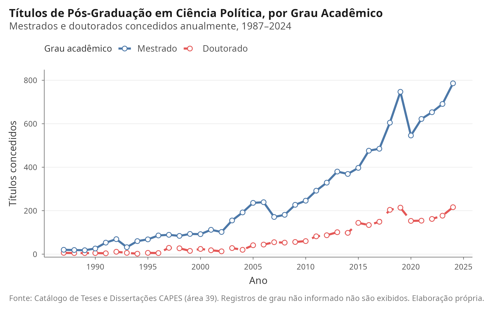{#fig-titulos width=95%}

A série mostra a diferença persistente de escala entre os níveis. O mestrado permaneceu acima do doutorado em todos os anos observados, enquanto ambos cresceram no período recente. Em conjunto, foram `r fmt_int(v_temp$total_titulos_cap)` trabalhos no período. O volume total passou de `r fmt_int(tab_temp$titulos[tab_temp$ano==1987])` títulos em 1987 para `r fmt_int(v_temp$pico_titulos_val)` em 2024, ano de maior número de registros, no fim da série e possivelmente subestimado pela defasagem de registro. Dois movimentos da série merecem nota: a queda acentuada entre 2019 e 2020, provável efeito da pandemia sobre o calendário de defesas e do registro, e a retomada nos anos seguintes. Esses dados descrevem uma expansão observada, mas não permitem atribuí-la isoladamente a uma política específica.

Paralelamente, a @fig-ppgs documenta o crescimento no número de programas em funcionamento e das instituições de ensino superior (IES) que abrigam programas da área.

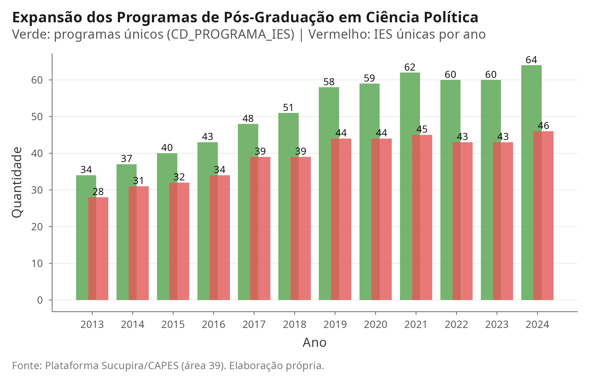{#fig-ppgs width=95%}

O número de programas observados passou de `r fmt_int(tab_temp$programas_unicos[tab_temp$ano==2013])` em 2013 para `r v_temp$max_programas_ano` em 2024, distribuídos por `r v_geo$total_ufs_com_ppg_2024` Unidades da Federação. No painel comparativo, a Ciência Política/RI passou de `r comp_ind$programas_ativos[comp_ind$ano == 2013 & comp_ind$area_nome == "Ciência Política / RI"]` para `r comp_ind$programas_ativos[comp_ind$ano == 2024 & comp_ind$area_nome == "Ciência Política / RI"]` programas entre 2013 e 2024, um crescimento relativo maior que o de qualquer área irmã (quase dobrou, contra uma variação de 2% na História no mesmo período), embora o número absoluto de programas em 2024 continue o menor das seis áreas (Figura 4). A instituição com maior volume acumulado de defesas no Catálogo CAPES é a `r v_geo$top_ies_nome`, responsável por `r fmt_int(v_geo$top_ies_n)` trabalhos de conclusão (o IUPERJ, instituto da UCAM, aparece separado na base; se fundidos, os totais seguem abaixo dos da USP).

### O Tamanho da Ciência Política Frente às Áreas Irmãs

Embora a trajetória própria da Ciência Política evidencie uma curva ascendente, a comparação com as disciplinas vizinhas nas Ciências Humanas e Sociais redimensiona esse crescimento, mas não da forma que a leitura mais intuitiva sugeriria. Em escala absoluta, a Área 39 seguiu pequena: em 2024 ela tinha o menor número de programas e de docentes entre as seis áreas comparadas (Figura 4, Tabela abaixo). Mas, em ritmo relativo, ela cresceu mais que todas as demais entre 1987 e 2024 (`r fmt_num(comp_metricas$crescimento_relativo[comp_metricas$area_nome=="Ciência Política / RI"]*100, 0)`%, contra `r fmt_num(comp_metricas$crescimento_relativo[comp_metricas$area_nome=="História"]*100, 0)`% na História e `r fmt_num(comp_metricas$crescimento_relativo[comp_metricas$area_nome=="Economia"]*100, 0)`% na Economia), porque partiu de uma base quase nula (`r comp_metricas$titulos_primeiro_ano[comp_metricas$area_nome=="Ciência Política / RI"]` títulos em 1987, contra `r comp_metricas$titulos_primeiro_ano[comp_metricas$area_nome=="História"]` na História e `r comp_metricas$titulos_primeiro_ano[comp_metricas$area_nome=="Economia"]` na Economia). Esse é um efeito de base, não um sinal de que a Ciência Política se equiparou às áreas irmãs; as duas leituras, escala e ritmo, são complementares e nenhuma substitui a outra.

A @fig-titulos-comparada ilustra o volume total de titulações (Mestrado e Doutorado) dessas disciplinas desde 1987, enquanto a @fig-ppgs-comparada projeta o número de programas ativos na Plataforma Sucupira na última década.

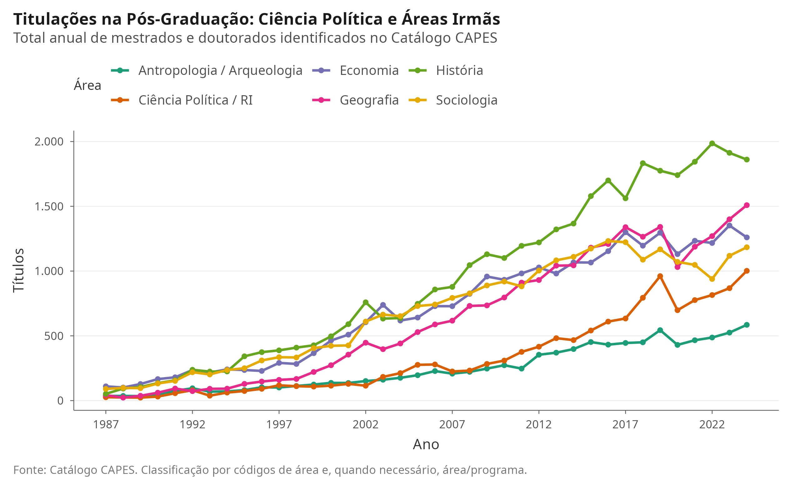{#fig-titulos-comparada width=95%}

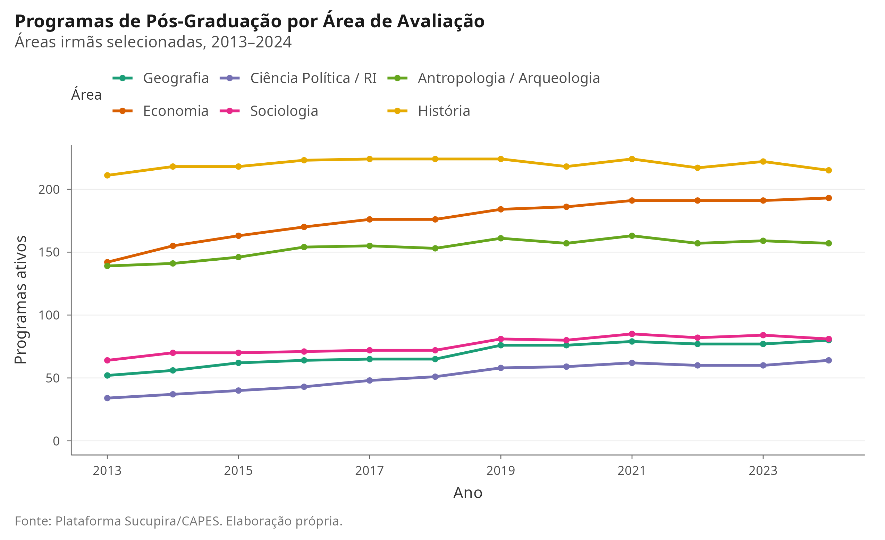{#fig-ppgs-comparada width=95%}

Os dados administrativos da CAPES demonstram que a Área 39 é menor que as áreas irmãs em número de programas e docentes, mas a comparação precisa ser feita por dimensão e não por uma escala única de prestígio. Em 2024, a Ciência Política e Relações Internacionais contava com `r comp_2024$programas_ativos[comp_2024$area_nome == "Ciência Política / RI"]` programas e `r fmt_int(comp_2024$docentes_unicos[comp_2024$area_nome == "Ciência Política / RI"])` docentes únicos. Na comparação, a História possuía `r comp_2024$programas_ativos[comp_2024$area_nome == "História"]` programas e `r fmt_int(comp_2024$docentes_unicos[comp_2024$area_nome == "História"])` docentes, a Economia `r comp_2024$programas_ativos[comp_2024$area_nome == "Economia"]` programas e `r fmt_int(comp_2024$docentes_unicos[comp_2024$area_nome == "Economia"])` docentes, a Geografia `r comp_2024$programas_ativos[comp_2024$area_nome == "Geografia"]` programas e `r fmt_int(comp_2024$docentes_unicos[comp_2024$area_nome == "Geografia"])` docentes, a Antropologia/Arqueologia `r comp_2024$programas_ativos[comp_2024$area_nome == "Antropologia / Arqueologia"]` programas e `r fmt_int(comp_2024$docentes_unicos[comp_2024$area_nome == "Antropologia / Arqueologia"])` docentes, e a Sociologia `r comp_2024$programas_ativos[comp_2024$area_nome == "Sociologia"]` programas e `r fmt_int(comp_2024$docentes_unicos[comp_2024$area_nome == "Sociologia"])` docentes.

A diferença não se limita ao tamanho. A Ciência Política/RI tinha `r fmt_num(comp_2024$docentes_por_programa[comp_2024$area_nome == "Ciência Política / RI"])` docentes por programa, contra `r fmt_num(comp_2024$docentes_por_programa[comp_2024$area_nome == "Sociologia"])` na Sociologia, `r fmt_num(comp_2024$docentes_por_programa[comp_2024$area_nome == "Economia"])` na Economia e `r fmt_num(comp_2024$docentes_por_programa[comp_2024$area_nome == "Geografia"])` na Geografia, mas mais que os `r fmt_num(comp_2024$docentes_por_programa[comp_2024$area_nome == "História"])` da História. Seu conceito médio (`r fmt_num(comp_2024$conceito_medio[comp_2024$area_nome == "Ciência Política / RI"])`) é descritivamente superior ao da Economia (`r fmt_num(comp_2024$conceito_medio[comp_2024$area_nome == "Economia"])`), mas inferior aos valores médios de História (`r fmt_num(comp_2024$conceito_medio[comp_2024$area_nome == "História"])`) e Antropologia/Arqueologia (`r fmt_num(comp_2024$conceito_medio[comp_2024$area_nome == "Antropologia / Arqueologia"])`). Conceitos não são diretamente equivalentes a qualidade entre áreas, pois dependem de critérios e distribuições próprios.

A formação de mestres e doutores reflete a mesma assimetria estrutural, mas deve ser lida com cuidado: a CAPES organiza áreas de avaliação, não disciplinas perfeitamente separadas, e os registros de títulos não são uma medida de qualidade. O contraste reforça o diagnóstico de que a Ciência Política brasileira se desenvolveu como um campo de pós-graduação estrita, enquanto História e Geografia possuem vínculos mais amplos com licenciaturas e formação de professores. Essa é uma hipótese institucional plausível, não testada diretamente pelos dados deste artigo.

### Formação por nível e intensidade institucional

A comparação por nível ajuda a distinguir a expansão dos programas do simples crescimento do volume agregado. A @fig-niveis-comparada separa mestrados e doutorados na janela comum de 2013 a 2024. Já a @fig-intensidade-comparada relaciona títulos registrados a programas ativos, indicador descritivo de intensidade de formação, e não de produtividade ou qualidade.

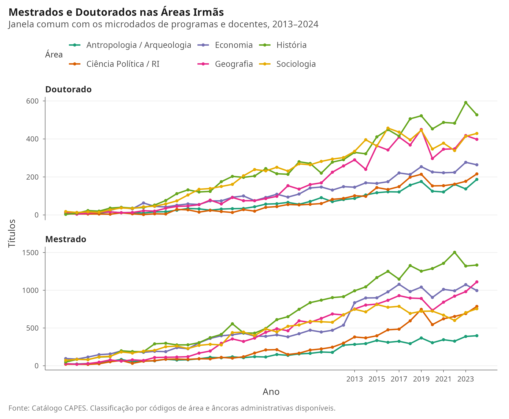{#fig-niveis-comparada width=95%}

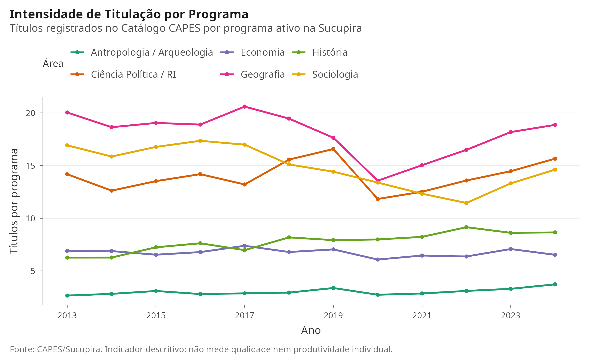{#fig-intensidade-comparada width=95%}

A utilidade desses indicadores é comparativa e não classificatória: uma área pode apresentar mais títulos por programa porque possui maior participação de mestrados profissionais, maior fluxo de estudantes ou diferentes durações e padrões de registro. Eles informam a escala e a estrutura da formação, enquanto a avaliação de qualidade requer dados de trajetória dos egressos, produção, financiamento e critérios da avaliação quadrienal.

## As Associações Científicas e a Escala dos Encontros

A comparação entre as áreas também pode ser feita pela infraestrutura associativa que cada campo construiu para circular a produção. Cada disciplina conta com uma associação nacional que organiza o encontro periódico da área: a ANPOCS (1977, encontro anual), guarda-chuva da pós-graduação em ciências sociais; a ABCP (1996, encontros bienais), da ciência política; a SBS (1950), da sociologia; a ABA (1955), da antropologia; a ANPUH (1961), da história; a ANPEC (1973), da economia; e a ANPEGE (1994, encontros bienais), da geografia. A idade das associações espelha a cronologia descrita na seção anterior: as disciplinas mais antigas constituíram suas entidades nas décadas de 1950 e 1960, enquanto a ciência política só ganhou associação própria em 1996, no ciclo de expansão da área.

A métrica mais consistente disponível para comparar a vitalidade dos encontros é o fluxo de trabalhos, embora cada associação publique indicadores distintos (inscritos, credenciados, submetidos, aprovados ou publicados). A @fig-assoc apresenta as séries com dados publicados: ANPOCS (propostas recebidas e aprovadas, 2005--2017), ANPEGE (trabalhos aceitos, 1995--2023), ANPEC (submetidos e aprovados, 2007--2017) e ANPUH (trabalhos inscritos, 1991--2007).

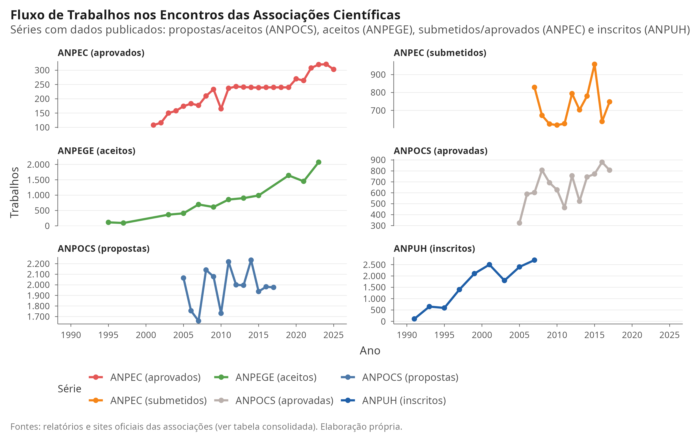{#fig-assoc width=100%}

Os dados revelam ordens de grandeza distintas. A ANPOCS recebeu entre 1.655 e 2.234 propostas por ano entre 2005 e 2017, aprovando de 324 a 880, o que corresponde a uma taxa de aprovação de 16% a 44%. A ANPEGE partiu de 114 trabalhos em 1995 e alcançou 1.642 em 2019 e 2.074 submetidos em 2023, com a estrutura do evento saltando de 10 eixos temáticos para 75 grupos de trabalho. A ANPEC recebeu entre 618 e 958 artigos por ano no período 2007--2017, aprovando cerca de 30%, e expandiu o número de aprovados de 108 em 2001 para cerca de 320 em 2023--2024 e 303 em 2025. A ANPUH registrou 2.400 trabalhos em 2005 e cerca de 2.700 em 2007, e seus simpósios nacionais reuniram de 6.000 a 8.000 participantes entre 2009 e 2013, a maior escala entre as áreas comparadas (o dado de 2013 é estimativa pré-evento).

A escala dos públicos confirma o gradiente, com as ressalvas de métrica já indicadas. As reuniões da ABA passaram de 1.117 participantes em 2010 para um pico de 3.761 em 2014, com 83 grupos de trabalho, e cerca de 2.800 inscritos em 2024. Os congressos da SBS reuniram de 250 participantes em 1997 a 2.360 em 2015 e 2.306 em 2019. O Encontro Anual da ANPOCS, medido por inscritos presentes, passou de 774 em 2001 para 1.641 em 2008 e oscilou entre cerca de 1.200 e 1.500 na década de 2010, com 1.193 credenciados na fase presencial de 2024.

A ciência política mobiliza a menor escala entre as associações de sociologia (SBS), antropologia (ABA) e história (ANPUH), embora em patamar semelhante ao da ANPOCS e da ANPEGE quando a comparação usa a mesma métrica de participantes. Os encontros da ABCP, iniciados em 1998, receberam 764 trabalhos em 2008, 963 submissões em 2012 (502 aprovadas, 756 participantes) e 1.068 trabalhos em 2024, com 1.722 inscritos. Mesmo com o crescimento recente, o encontro bienal da disciplina permanece abaixo do porte das áreas irmãs maiores, o que é consistente com os `r fmt_int(v_temp$max_programas_ano)` programas e o déficit histórico de expansão documentado nas seções anteriores. A @fig-assoc-participantes resume a escala de participantes na edição mais recente com dado disponível, evidenciando a posição da ABCP no conjunto.

Os encontros de 2025 e 2026 confirmam que a estrutura dos eventos continua a crescer, embora os balanços quantitativos realizados dessas edições ainda não tenham sido publicados. O 49º Encontro da ANPOCS (Campinas, 2025) abriu 68 grupos de trabalho e 29 seminários de pesquisa, com cerca de 1.200 participantes previstos antes do evento. O 15º Encontro da ABCP (Belém, 2026) organizou 18 áreas temáticas, o 33º Simpósio Nacional de História (Belo Horizonte, 2025) reuniu 162 simpósios temáticos e a 35ª Reunião Brasileira de Antropologia (Goiânia, 2026) abriu cerca de 115 grupos de trabalho. Como os relatórios de gestão costumam ser divulgados um ou dois anos após cada encontro, os totais realizados de inscritos e de trabalhos dessas edições ainda não podem ser comparados aos das anteriores.

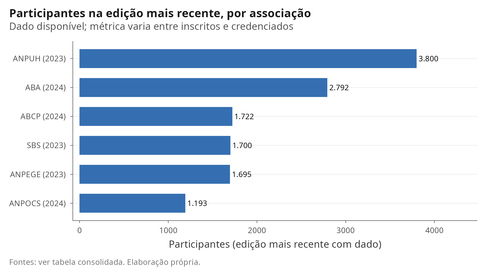{#fig-assoc-participantes width=95%}

```{r tab-associacoes, echo=FALSE}
#| label: tbl-associacoes
#| tbl-cap: "Associações científicas das áreas comparadas: fundação, cadência e dados da edição mais recente com informação disponível"
tab_assoc <- read_csv(here::here("TABELAS", "tabela_associacoes_resumo.csv"), show_col_types = FALSE)
knitr::kable(tab_assoc,
  col.names = c("Associação", "Fundação", "Cadência", "Participantes", "Trabalhos", "Edição mais recente (2025–2026)"),
  align = c("l", "c", "l", "l", "l", "l")
) |>
  kableExtra::kable_styling(font_size = 8, latex_options = c("hold_position", "scale_down")) |>
  kableExtra::column_spec(4, width = "2.6cm") |>
  kableExtra::column_spec(5, width = "3.0cm") |>
  kableExtra::column_spec(6, width = "4.2cm")
```

A @tbl-associacoes resume os dados da edição mais recente com informação disponível. Para lê-la, três distinções são essenciais. Entre pessoas, *inscritos* são os que se registraram no sistema, *credenciados* ou *presentes* são os que efetivamente compareceram, e *previstos* são estimativas pré-evento. Entre trabalhos, *submetidos* são os enviados, *aprovados* os aceitos e *apresentados* ou *publicados* os que saíram do evento ou entraram nos anais. Comparar o número de inscritos de uma associação com o de credenciados de outra induz a erro; as células da tabela indicam a métrica e o ano de cada número. A taxa de aprovação (aprovados divididos por submetidos) é o indicador menos incomparável entre associações, ainda que as definições de "aprovado" variem: na ANPOCS, entre 16% e 44% no período 2005-2017; na ANPEC, entre 21% e 38% no período 2007-2017; e na ABCP, 52% em 2012. Duas ressalvas adicionais se impõem. Os números mais antigos vêm de relatórios institucionais e capas de anais, nem sempre com o mesmo rigor das estatísticas atuais. As séries também deixam lacunas: células vazias na tabela consolidada indicam indicadores não publicados pelas associações. Ainda assim, o padrão é claro: a ordem de grandeza dos encontros acompanha a do sistema de pós-graduação, e a juventude institucional da ciência política ajuda a explicar a escala mais contida de seus encontros.

## A Composição da Área 39: Ciência Política, Relações Internacionais, Políticas Públicas e Defesa

A Área 39 da CAPES é mais ampla do que seu nome sugere. Sob o rótulo de Ciência Política e Relações Internacionais, o sistema de avaliação abriga hoje programas de políticas públicas, de defesa e segurança e de estudos estratégicos. Essa composição interna, quase sempre tratada de forma agregada na literatura, pode ser separada a partir do nome dos programas no catálogo e na Plataforma Sucupira. A @fig-subareas apresenta a evolução dessa composição entre 1995 e 2024.

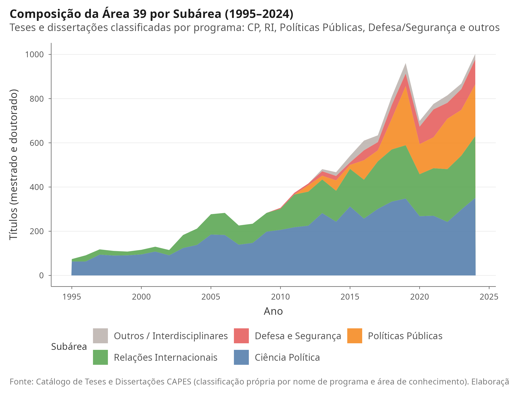{#fig-subareas width=95%}

A separação revela uma área em transformação. Em 2024, `r fmt_num(v_sub$pct_cp_2024)`% dos títulos vieram de programas de ciência política estrita, `r fmt_num(v_sub$pct_ri_2024)`% de relações internacionais, `r fmt_num(v_sub$pct_pp_2024)`% de políticas públicas e `r fmt_num(v_sub$pct_def_2024)`% de defesa e segurança. A distribuição dos `r fmt_int(v_sub$n_programas_2024_cp + v_sub$n_programas_2024_ri + v_sub$n_programas_2024_pp + v_sub$n_programas_2024_def)` programas ativos em 2024 acompanha essa diversidade, com `r fmt_int(v_sub$n_programas_2024_cp)` programas de ciência política, `r fmt_int(v_sub$n_programas_2024_ri)` de relações internacionais, `r fmt_int(v_sub$n_programas_2024_pp)` de políticas públicas e `r fmt_int(v_sub$n_programas_2024_def)` de defesa e segurança. O dado sugere que a expansão recente da área não se deu apenas pela multiplicação de programas de ciência política estrita, mas pela incorporação de tradições vizinhas, em especial as políticas públicas e os estudos de defesa. Essa hibridização deve ser levada em conta em qualquer diagnóstico sobre a disciplina: parte do que se convencionou chamar de expansão da ciência política brasileira é, na verdade, expansão de campos limítrofes abrigados sob a mesma área de avaliação.

## Dinâmica Espacial: A Desconcentração Regional

A expansão institucional foi acompanhada por uma desconcentração geográfica relevante. A @fig-mapa compara a localização dos programas em 2013 e em 2024: cada círculo representa um município, com área proporcional ao número de programas em funcionamento. A @fig-regioes complementa a leitura com a evolução da participação relativa das grandes regiões do país.

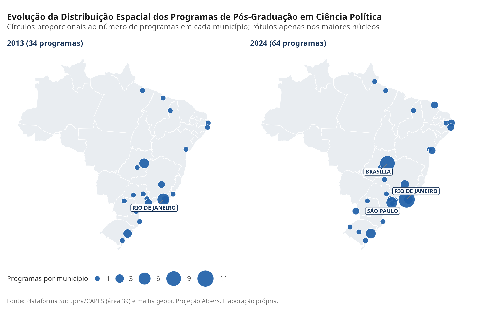{#fig-mapa width=100%}

A comparação dos dois painéis mostra o adensamento da rede: em 2013, os programas concentravam-se em `r v_geo$n_municipios_2013` municípios; em 2024, espalham-se por `r v_geo$n_municipios_2024`, com a multiplicação de núcleos de pequeno porte no interior e nas regiões Norte e Centro-Oeste. Os maiores polos municipais permanecem Rio de Janeiro, Brasília e São Paulo. A composição regional também mudou: a participação do Sudeste caiu de `r fmt_num(v_geo$pct_sudeste_2013)`% em 2013 para `r fmt_num(v_geo$pct_sudeste_2024)`% em 2024. A desconcentração é relativa: o Sudeste segue como a maior região, e o crescimento dos demais polos representa ampliação da capilaridade nacional da área.

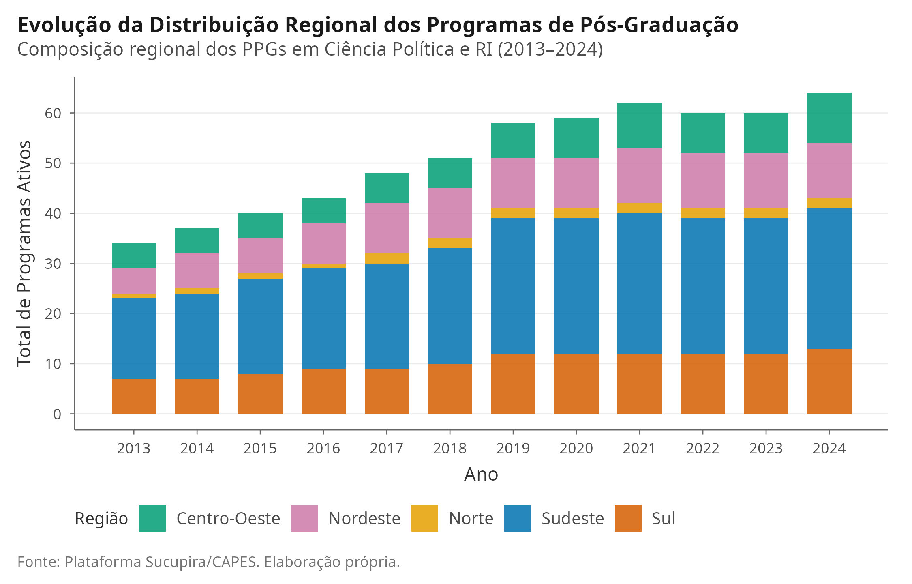{#fig-regioes width=95%}

## A Produção em Periódicos Canônicos

A produção científica veiculada nas revistas de maior prestígio acadêmico da área apresenta um comportamento consolidado ao longo de mais de quatro décadas. A @fig-artigos e a @fig-periodicos detalham o fluxo anual de publicações, restrito a artigos de pesquisa (editoriais, resenhas e erratas foram excluídos).

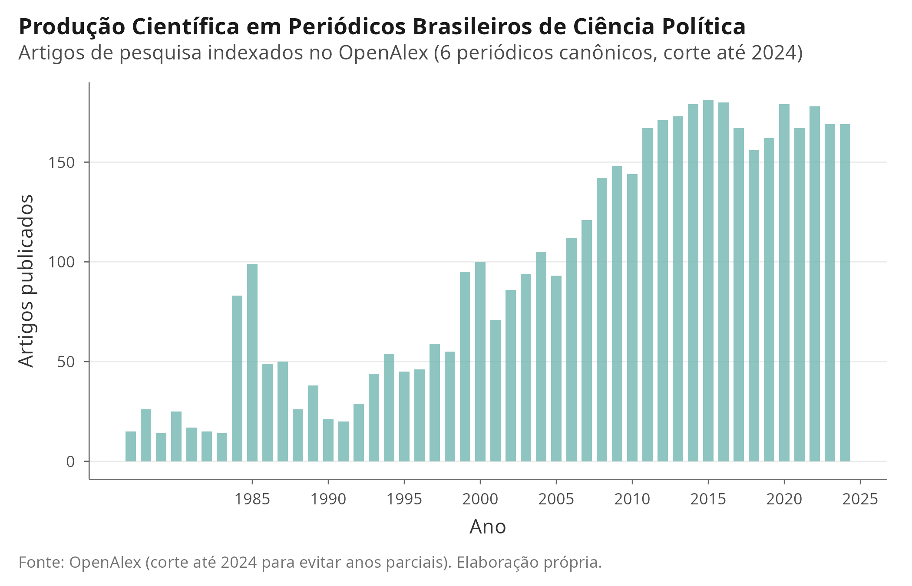{#fig-artigos width=95%}

O corpus reúne `r fmt_int(v_temp$total_artigos)` artigos de pesquisa publicados até 2024 e atinge seu ápice em `r v_temp$pico_artigos_ano`, com `r v_temp$pico_artigos_val` artigos. O corte em 2024 evita interpretar como queda ou crescimento os anos ainda incompletos da indexação. A participação relativa de cada periódico ao longo do tempo (@fig-periodicos) evidencia a longevidade de revistas pioneiras como *DADOS* e *Lua Nova*, combinada à presença de *Opinião Pública*, *Revista de Sociologia e Política*, *RBCP* e *BPSR*. Ressalva-se que a cobertura do OpenAlex não é uniforme: a *DADOS* aparece apenas a partir de 1977 e a *Opinião Pública* a partir de 1993, de modo que os anos iniciais da série refletem sobretudo a produção de *DADOS* e *Lua Nova*.

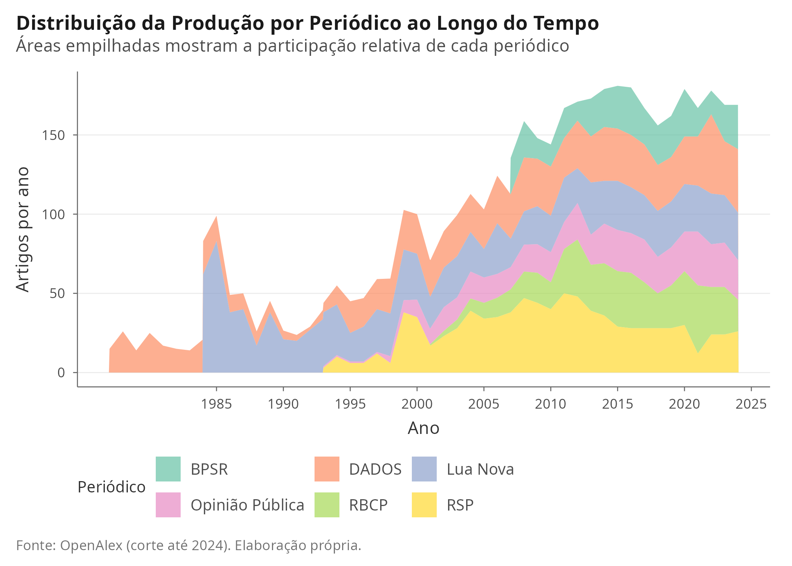{#fig-periodicos width=95%}

## Evolução Temática: Modelagem Estrutural de Tópicos (STM)

Para descrever a composição semântica do corpus sem impor categorias *a priori*, aplicou-se o *Structural Topic Model* (STM) [@roberts2014stm] a `r fmt_int(v_stm$corpus_stm_n)` resumos de teses, dissertações e artigos científicos. O modelo é exploratório: seus tópicos condensam coocorrências lexicais e devem ser interpretados em conjunto com os termos característicos apresentados na tabela, não como classificações substantivas observadas diretamente. Nenhuma inferência estatística formal é feita neste artigo: as prevalências de tópicos são descritivas e sem intervalos de incerteza.

O modelo com $K = 8$ tópicos foi estimado por simplicidade e comparabilidade com a literatura de modelagem de tópicos na área; a escolha não foi validada por procedimentos formais de seleção (como *held-out likelihood* ou coerência semântica), o que recomenda tratar os rótulos e as tendências como hipóteses a confirmar por leitura humana. O modelo recuperou núcleos temáticos reconhecíveis, ao lado de dois tópicos marcados por idioma (espanhol e inglês):

```{r tab-topicos-stm, echo=FALSE}
tab_top <- read_csv(here::here("TABELAS", "tabela_topicos_stm.csv"), show_col_types = FALSE)
knitr::kable(
  tab_top,
  caption = "Tópicos Temáticos Identificados via Structural Topic Model (STM)",
  col.names = c("Tópico", "Termos Característicos (FREX)", "Termos de Alta Probabilidade")
)
```

A @fig-stm-tempo apresenta a evolução da prevalência esperada de cada tópico entre 1995 e 2024, enquanto a @fig-stm-heatmap sintetiza a transição de prevalência por décadas.

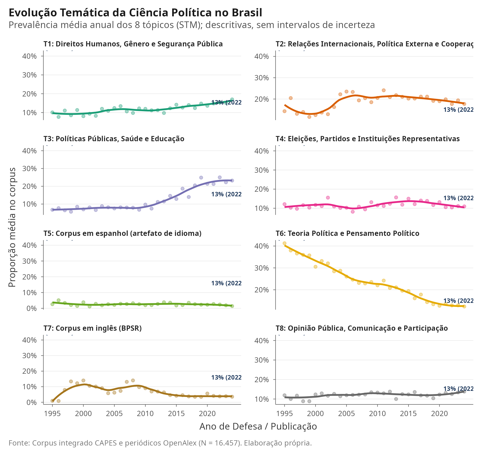{#fig-stm-tempo width=100%}

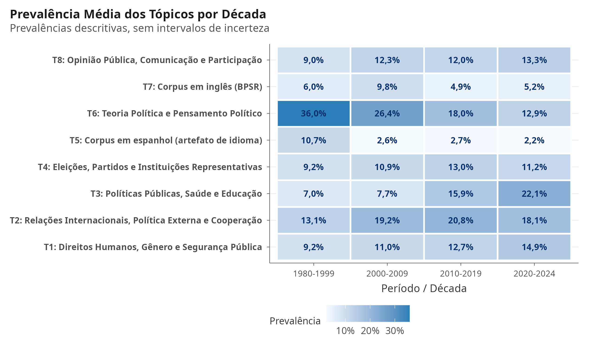{#fig-stm-heatmap width=95%}

A leitura substantiva dos tópicos, alinhada aos termos característicos da tabela, descreve um campo em movimento. O tópico de teoria política e pensamento político, dominante nos anos 1980 e 1990, perdeu espaço de forma acentuada, enquanto cresceram os tópicos de políticas públicas, saúde e educação, de relações internacionais e de direitos humanos e gênero, além do tópico de opinião pública e comunicação. Os estudos eleitorais e das instituições representativas mantiveram presença relevante e relativamente estável.

Dois tópicos são marcados por vocabulário em espanhol e em inglês, reflexo dos resumos multilíngues do corpus, e devem ser tratados como artefatos de idioma, não como linhas substantivas de pesquisa. Por isso, as figuras devem ser lidas como um mapa exploratório das transformações do corpus, e não como medida definitiva da prevalência de subáreas. Uma etapa subsequente deverá validar os rótulos por leitura humana de documentos com alta prevalência em cada tópico, testar a estabilidade do modelo em diferentes valores de $K$ e sementes e, se necessário, reestimar o modelo com corpus linguisticamente homogêneo.

---

# Discussão

Os achados deste texto comemorativo permitem revisitar seis décadas de construção institucional da Ciência Política no Brasil à luz da comparação com as demais ciências sociais. Três implicações merecem destaque.

Em primeiro lugar, a escala do sistema. A superação do confinamento geográfico original demonstra a eficácia do modelo indutor da CAPES: a interiorização dos programas e a formação contínua de docentes em todas as regiões transformou a Ciência Política em uma rede nacional. Em comparação com a Geografia ou a Sociologia, que possuem programas em quase todos os estados por causa da pressão formadora das licenciaturas, a expansão da disciplina foi demográfica e territorialmente mais contida, preservando um caráter de pesquisa especializada. Esse contraste importa para a governança da área: as políticas de expansão que funcionaram para outras ciências sociais não podem ser transpostas mecanicamente para um campo cuja demanda formativa é outra.

Em segundo lugar, a evolução temática. A queda acentuada da teoria política (dominante até a década de 1990) e o avanço de agendas como políticas públicas, estudos eleitorais, relações internacionais e, mais recentemente, direitos e gênero indicam uma inflexão temática consistente, na direção apontada por Soares [@soares2005calcanhar] e Marenco [@marenco2014heels]. Esse resultado não demonstra, por si só, a superação do "calcanhar metodológico": a identificação da mudança de métodos exigiria codificação explícita dos desenhos de pesquisa (inferência causal, modelagem preditiva, métodos experimentais), tarefa que permanece para uma extensão futura.

Em terceiro lugar, a composição interna da Área 39 qualifica o diagnóstico de expansão. Parte substancial do crescimento recente, em especial a partir da década de 2010, não ocorreu em programas estritos de Ciência Política, mas em arranjos institucionais de Políticas Públicas e, notavelmente, de Defesa e Segurança. Essa hibridização tem duas leituras. De um lado, revela a porosidade do campo e sua capacidade de absorver objetos interdisciplinares e abordagens da *policy science* e dos estudos estratégicos. De outro, impõe cautela às comparações históricas: os indicadores de crescimento institucional da última década englobam fluxos de pesquisa e tradições epistêmicas que não partilham, necessariamente, o núcleo teórico e metodológico da Ciência Política clássica. Um diagnóstico preciso exige, portanto, separar esses fluxos, como feito na seção de resultados.

A comunidade disciplinar defronta-se, por fim, com desafios persistentes: a manutenção do financiamento público da pós-graduação, a redução das assimetrias de produtividade entre programas consolidados e emergentes e a ampliação da diversidade e equidade de gênero e raça na liderança acadêmica da área [@biroli2021mulheres; @candido2023mundo].

---

# Conclusão

Ao se completarem 60 anos desde a criação dos primeiros programas de pós-graduação da área, a Ciência Política no Brasil apresenta uma infraestrutura nacional de formação, um conjunto amplo de canais de publicação e agendas diversificadas. A análise de `r fmt_int(v_temp$total_titulos_cap)` trabalhos de conclusão e `r fmt_int(v_temp$total_artigos)` artigos de pesquisa documenta essa trajetória: uma expansão mais tardia e contida demograficamente do que a das áreas irmãs, mas com elevado grau de profissionalização. O vocabulário dos resumos desloca-se da teoria política para objetos empíricos, como políticas públicas, comportamento eleitoral e relações internacionais, e a Área 39 abriga hoje, em larga medida, campos limítrofes como a Defesa e as Políticas Públicas. Isso convida a um olhar mais preciso sobre o que conta como ciência política: parte do que se chama de expansão da disciplina é expansão de campos vizinhos sob a mesma área de avaliação. O próximo ciclo combina o aprofundamento das metodologias inferenciais e da pluralidade temática com o compromisso com a transparência, a diversidade e a reprodutibilidade dos dados.

---

# Apêndice de Reprodutibilidade {.unnumbered}

## Ambiente de Replicação

Todo o pipeline analítico, desde a coleta automatizada de dados abertos até a modelagem estatística e a compilação deste manuscrito, foi executado em ambiente reprodutível em **R (v`r getRversion()`)** e **Quarto (`r system("quarto --version", intern = TRUE)`)**. Os códigos, as sementes aleatórias (fixada em `20260828`) e as rotinas de replicação, incluindo o relatório do protocolo exploratório (Camada 2), estarão disponíveis em repositório GitHub a ser criado para o projeto.

```{r session-info, echo=FALSE}
sessionInfo()
```

# Referências {.unnumbered}
