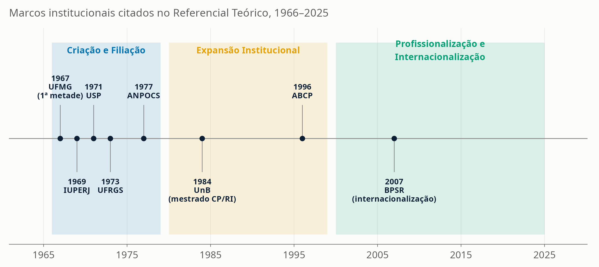
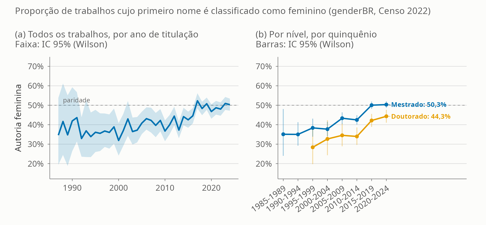

```{r setup, include=FALSE}
source(here::here("SCRIPTS", "00_setup.R"))

v_temp <- readRDS(here::here("DADOS", "processed", "valores_inline_temporal.rds"))
v_geo  <- readRDS(here::here("DADOS", "processed", "valores_inline_geografia.rds"))
v_sub  <- readRDS(here::here("DADOS", "processed", "valores_inline_subareas.rds"))
v_stm  <- readRDS(here::here("DADOS", "processed", "valores_inline_stm.rds"))
tab_temp <- readRDS(here::here("DADOS", "processed", "tabela_series_temporais.rds"))
comp_ind <- read_csv(here::here("TABELAS", "tabela_comparacao_painel_integrado.csv"), show_col_types = FALSE)
comp_2024 <- comp_ind %>% filter(ano == max(ano, na.rm = TRUE))
comp_metricas <- read_csv(here::here("TABELAS", "tabela_comparacao_metricas_capes.csv"), show_col_types = FALSE)
grau_ano <- readRDS(here::here("DADOS", "processed", "capes_titulos_por_grau_ano.rds"))
# Artefatos da rodada de correção 2026-09-02 (códigos de área de avaliação,
# modalidade profissional, gênero da autoria). Mesmos objetos que alimentam o
# artigo — nenhum número desta apresentação é digitado à mão.
v_comp <- readRDS(here::here("DADOS", "processed", "valores_inline_comparacao.rds"))
v_gen  <- readRDS(here::here("DADOS", "processed", "valores_inline_genero.rds"))
comp_cagr <- read_csv(here::here("TABELAS", "tabela_comparacao_cagr.csv"), show_col_types = FALSE)
v_stm_ef <- readRDS(here::here("DADOS", "processed", "valores_inline_stm_efeitos.rds"))
v_conc <- readRDS(here::here("DADOS", "processed", "valores_inline_concentracao.rds"))

# Ordena as seis áreas pelo número de programas em 2024, para o texto do slide
# não precisar afirmar "a maior" nem "a menor" à mão.
prog24 <- sort(v_comp$programas_2024, decreasing = TRUE)
lista_areas <- function(x, sufixo = "") paste0(
  paste0(names(x), " (", format(unname(x), big.mark = "."), sufixo, ")"), collapse = ", ")
# Títulos por programa em 2024: usado no slide de escala x intensidade.
tpp <- setNames(comp_2024$titulos / comp_2024$programas_ativos, comp_2024$area_nome)
cagr_1524 <- function(area) 100 * comp_cagr$cagr[comp_cagr$janela == "2015-2024" &
                                                   comp_cagr$area_nome == area]
```

## Sessenta anos depois, quanto do que chamamos de "expansão da Ciência Política" é, de fato, Ciência Política? {.big-title}

::: {style="margin-top:3%;"}
{width=92%}
:::

::: {.notes}
Slide de abertura conceitual, fundido com a linha do tempo. O ponto a plantar: a narrativa corrente de expansão pode estar, em boa parte, contando a história de campos limítrofes — a Área 39 da CAPES também abriga Relações Internacionais, Políticas Públicas, Defesa e Estudos Estratégicos e Segurança Pública. Este é um retrato empírico do sistema de pós-graduação da área, sem transformar crescimento observado em efeito causal de nenhuma política específica.

Três idades sintetizadas de Forjaz (1997) e Lamounier (1989), como no Referencial Teórico do artigo (§2.1): (1) Criação e Filiação (anos 1960-70) — primeiros programas, foco no autoritarismo, na estrutura corporativa do Estado e na transição democrática; (2) Expansão Institucional (anos 1980-90) — novos programas e canais (ANPOCS, ABCP), agenda desloca-se para as instituições da Nova República (eleições, partidos, Congresso, federalismo); (3) Profissionalização e Internacionalização (século XXI) — diversificação temática, sofisticação analítica, inserção internacional.

Datas conferidas na auditoria de dados do projeto. UFMG: organizou-se institucionalmente em 1966 (após a Resolução 11 de dez/1965, que criou o Departamento de Ciência Política), mas só recebeu a primeira turma do mestrado em março de 1967; o credenciamento efetivo na CAPES só veio em 1973 (fonte: página oficial do PPGCP-UFMG). Revista DADOS: fundada em 1966 pelo IUPERJ (fonte: dados.iesp.uerj.br).
:::

## A pós-graduação como motor de autonomização

- A institucionalização da Ciência Política no Brasil não veio da graduação: foi puxada de cima para baixo pelo sistema de avaliação e fomento da CAPES [@leite2013autonomizacao]
- A criação da Área 39 deu ao campo critérios próprios de produtividade (Qualis Periódicos) e metas de titulação
- Mas a expansão foi mais lenta que a das áreas irmãs: até a virada do milênio, um "déficit de doutores" atrasou a criação de novos centros fora do eixo Sudeste [@marenco2014heels]
- Diferença de origem: Geografia e História cresceram puxadas pela demanda de professores para a educação básica; a Ciência Política nasceu voltada à pesquisa avançada — daí sua menor capilaridade inicial

::: {.notes}
Ponte para os dados: o restante da apresentação testa empiricamente essa leitura institucional — quanto a Área 39 de fato se expandiu, e a que ritmo em relação às áreas irmãs.
:::

## O "calcanhar metodológico" ganhou infraestrutura

- @soares2005calcanhar diagnosticou a carência de treinamento empírico formal. A resposta institucional mais duradoura **antecede o diagnóstico**
- **MQ² (UFMG, 1999)**: nasceu na Sociologia, não na Ciência Política — a formação quantitativa chegou à Área 39 por uma porta lateral, compartilhada com uma área irmã
- **IPSA-USP Summer School (2010)**: a primeira escola de verão da IPSA no mundo; 87 participantes na 1ª edição, 225 em 2016
- Mas a trajetória **não é ascendente contínua**: o MODUS (escola própria do PPGCP-UFMG) durou de 2017 a 2022, e a IPSA-USP não teve edições em 2022, 2023 e 2026

::: {.notes}
MQ²/UFMG: Programa Intensivo em Metodologia Quantitativa e Qualitativa, fundado em 1999 no PPG em Sociologia e no Centro de Pesquisas Quantitativas em Ciências Sociais da FAFICH; edições anuais em julho, cursos de extensão de curta duração; 26ª edição em 2026 com 23 cursos e mais de três mil participantes formados. O PPGCP da UFMG manteve escola própria (MODUS) entre 2017 e 2022 — 630 horas-aula, 31 professores de sete instituições e mais de 750 inscrições nas três primeiras edições — e voltou ao MQ² em 2023.

IPSA-USP: primeira edição em fevereiro de 2010, organizada pelo Departamento de Ciência Política da FFLCH-USP com o CEM e o NECI; 16ª edição anunciada para janeiro de 2027.

Outros centros seguiram: Escola de Inverno do IESP-UERJ, Escola de Métodos do IPOL-UnB, Escola de Métodos Quantitativos da FGV-EAESP. A oferta deixou de ser monopólio de dois centros.

Ressalva importante: nada disso mede método. Este trabalho observa temas nos resumos, não desenhos de pesquisa. E, se a área abriga hoje comunidades tão distintas, falar de um "calcanhar metodológico" da área supõe uma unidade que talvez não exista mais.
:::

## O sistema cresceu `r fmt_num(v_temp$pico_titulos_val / tab_temp$titulos[tab_temp$ano==1987], 0)` vezes em quatro décadas

{width=92%}

::: {.notes}
`r fmt_int(tab_temp$titulos[tab_temp$ano==1987])` títulos em 1987 → `r fmt_int(v_temp$pico_titulos_val)` em 2024. A queda de 2019 para 2020 (`r fmt_int(tab_temp$titulos[tab_temp$ano==2019])` → `r fmt_int(tab_temp$titulos[tab_temp$ano==2020])`) é provavelmente efeito da pandemia sobre o calendário de defesas e de registro, não uma reversão da tendência — a série se recupera nos anos seguintes.

O mestrado permaneceu acima do doutorado em todos os anos observados. 2024 é o último ano da série e pode estar subestimado pela defasagem de registro.
:::

## …e se espalhou pelo território

{width=92%}

Municípios com programas: `r v_geo$n_municipios_2013` (2013) → `r v_geo$n_municipios_2024` (2024). Participação do Sudeste: `r fmt_num(v_geo$pct_sudeste_2013)`% → `r fmt_num(v_geo$pct_sudeste_2024)`%.

::: {.notes}
Desconcentração relativa, não reversão: o Sudeste segue como a maior região. Os maiores polos municipais permanecem Rio de Janeiro, Brasília e São Paulo.

E a desconcentração é mais institucional do que territorial. O HHI de títulos por instituição caiu de `r fmt_num(v_conc$hhi_ies_39_2013, 3)` (2013) para `r fmt_num(v_conc$hhi_ies_39_2024, 3)` (2024), mas o Gini das titulações entre unidades da federação subiu de `r fmt_num(v_conc$gini_uf_39_2013, 3)` para `r fmt_num(v_conc$gini_uf_39_2024, 3)`: os novos programas se somaram sobretudo a estados que já formavam.
:::

## Não é a menor área. É a menos capilar.

{width=90%}

`r fmt_int(v_comp$programas_2024[["Ciência Política / RI"]])` programas em 2024: a **`r v_comp$posicao_area39_programas_2024`ª de seis**. Presente em **`r fmt_int(v_comp$ufs_2024[["Ciência Política / RI"]])` UFs**, a menor cobertura do grupo. Cresceu **`r fmt_num(v_comp$var_programas_pct[["Ciência Política / RI"]], 0)`%** em programas entre 2013 e 2024, mais que qualquer irmã.

::: {.notes}
Este slide corrige a leitura corrente — e a versão anterior desta própria apresentação. Com os códigos de área de avaliação da Sucupira conferidos contra o campo `NM_AREA_AVALIACAO` (28 Economia, 34 Sociologia, 35 Antropologia/Arqueologia, 36 Geografia, 39 CP/RI, 40 História), a Área 39 aparece à frente de `r lista_areas(prog24[5:6])` e atrás de `r lista_areas(prog24[1:3])`.

Três afirmações distintas, que a versão anterior confundia numa só: (1) em número de programas, a área é intermediária, não a menor; (2) o que ela tem de menor é a cobertura territorial — `r fmt_int(v_comp$ufs_2024[["Ciência Política / RI"]])` UFs contra `r fmt_int(v_comp$ufs_2024[["Geografia"]])` da Geografia e `r fmt_int(v_comp$ufs_2024[["História"]])` da História; (3) foi a que mais cresceu em programas na última década.

A hipótese institucional corrente — CP como campo de pesquisa estrita, História e Geografia expandidas pela demanda das licenciaturas — segue plausível para explicar a diferença de cobertura territorial, mas não é testada por estes dados.
:::

## O crescimento recente é o mais rápido das seis áreas

::: columns
::: {.column width="60%"}
{width=98%}
:::
::: {.column width="40%"}
**Títulos, crescimento composto ao ano (2015–2024):**

- Ciência Política/RI: **`r fmt_num(cagr_1524("Ciência Política / RI"), 1)`%**
- Antropologia: `r fmt_num(cagr_1524("Antropologia / Arqueologia"), 1)`%
- Geografia: `r fmt_num(cagr_1524("Geografia"), 1)`%
- História: `r fmt_num(cagr_1524("História"), 1)`%
- Economia: `r fmt_num(cagr_1524("Economia"), 1)`%
- Sociologia: `r fmt_num(cagr_1524("Sociologia"), 1)`%

Em volume, a distância persiste: `r fmt_int(v_temp$pico_titulos_val)` títulos em 2024, contra `r fmt_int(comp_2024$titulos[comp_2024$area_nome=="História"])` da História.
:::
:::

::: {.notes}
Preferimos a taxa composta por década à variação 1987→2024. Aquela leitura (`r fmt_num(comp_metricas$crescimento_relativo[comp_metricas$area_nome=="Ciência Política / RI"]*100, 0)`% de crescimento relativo) é pouco informativa porque a base de 1987 é quase nula (`r comp_metricas$titulos_primeiro_ano[comp_metricas$area_nome=="Ciência Política / RI"]` títulos) e o Catálogo é reconhecidamente incompleto naquele ano: qualquer crescimento posterior vira uma taxa espetacular.

Escala e ritmo são leituras complementares; nenhuma substitui a outra.
:::

## Programas menores, titulação menos intensa

{width=86%}

::: {.notes}
A área ficou no meio do eixo horizontal (escala) e na parte baixa do vertical: `r fmt_num(tpp[["Ciência Política / RI"]])` títulos por programa em 2024, contra `r fmt_num(tpp[["História"]])` da História e `r fmt_num(tpp[["Sociologia"]])` da Sociologia. No artigo, o mesmo padrão aparece no corpo docente: a Área 39 tem `r fmt_num(comp_2024$docentes_por_programa[comp_2024$area_nome == "Ciência Política / RI"])` docentes permanentes por programa, contra `r fmt_num(comp_2024$docentes_por_programa[comp_2024$area_nome == "Sociologia"])` na Sociologia. Programas mais numerosos e, em média, menores.

Não é um ranking de desempenho. A razão títulos/programa pode refletir composição por nível, fluxo de estudantes, participação de mestrados profissionais ou padrões de registro — não produtividade ou qualidade.
:::

## {background-color="#0B1E33"}

::: {style="color:#F2F2F2; text-align:center; padding-top:12%;"}
### O achado central
:::

## A Área 39 não é a Ciência Política {.smaller}

{width=94%}

::: {.notes .fragment}
Em 2024, apenas `r fmt_num(v_sub$pct_cp_2024)`% dos títulos da Área 39 vieram de Ciência Política estrita. Relações Internacionais (`r fmt_num(v_sub$pct_ri_2024)`%), Políticas Públicas (`r fmt_num(v_sub$pct_pp_2024)`%), Defesa e Estudos Estratégicos (`r fmt_num(v_sub$pct_def_2024)`%) e Segurança Pública (`r fmt_num(v_sub$pct_segpub_2024)`%) dividem o resto. Parte substancial da "expansão da Ciência Política brasileira" é, na verdade, expansão de campos limítrofes abrigados sob o mesmo sistema de avaliação.

Segurança Pública aparece em categoria própria, e não como subconjunto da Defesa: um programa sobre policiamento e sistema prisional não compartilha objeto nem literatura com um programa de estudos estratégicos militares.

A classificação é feita pelo nome do programa, e mede filiação institucional, não conteúdo. Uma amostra estratificada de `r fmt_int(v_sub$validacao$n)` títulos foi reclassificada à mão: `r fmt_num(v_sub$validacao$acuracia_amostra)`% de concordância (kappa `r fmt_num(v_sub$validacao$kappa_auto_humano, 2)`). São estimativas com erro medido, não contagens exatas.
:::

## Defesa e Segurança Pública: dois campos novos, não um

- Primeiro título de defesa registrado em **`r v_sub$primeiro_ano_def`**; **`r fmt_int(v_sub$total_def)` títulos** acumulados até 2024
- Em 2024: **`r v_sub$n_programas_2024_def` programas de defesa** e **`r v_sub$n_programas_2024_segpub` de segurança pública**, contra **`r v_sub$n_programas_2024_cp` de Ciência Política estrita**
- A segurança pública é contada à parte: policiamento e sistema prisional não partilham objeto nem literatura com estudos estratégicos militares
- Hibridização com a *policy science* e os estudos estratégicos — e em boa medida na **modalidade profissional**: `r fmt_num(v_comp$pct_prof_2024[["Ciência Política / RI"]])`% dos programas da área, a maior proporção das seis

::: {.notes}
Esse crescimento é recente e concentrado: praticamente todo ele ocorreu na década de 2010, junto com Políticas Públicas. Em 2013 a proporção de programas profissionais era de `r fmt_num(v_comp$pct_prof_2013[["Ciência Política / RI"]])`%; Sociologia e Antropologia/Arqueologia não têm nenhum.

A segurança pública ainda é pequena — `r fmt_num(v_sub$pct_segpub_2024)`% dos títulos de 2024 — e por isso não sustenta desagregações finas.
:::

## Mais mulheres — mas não no doutorado

{width=96%}

::: {.notes}
O catálogo da CAPES não registra sexo nem gênero, mas registra o nome completo. Imputação probabilística pelo primeiro nome com o pacote `genderBR` [@meireles2026genderbr], frequências do Censo do IBGE de `r v_gen$censo_ano`, limiar de `r fmt_num(v_gen$limiar, 1)`: `r fmt_pct(v_gen$taxa_classificacao, 1)` dos `r fmt_int(v_gen$n_trabalhos)` trabalhos receberam classificação.

A participação feminina sobe de `r fmt_pct(v_gen$fem_1987_1991, 1)` em 1987--1991 para `r fmt_pct(v_gen$fem_2020_2024, 1)` em 2020--2024, `r fmt_num(v_gen$variacao_pp, 1)` pontos percentuais. Razão de chances de `r fmt_num(v_gen$or_decada, 2)` por década (IC 95%: `r fmt_num(v_gen$or_decada_ic[1], 2)`--`r fmt_num(v_gen$or_decada_ic[2], 2)`).

A leitura correta é de **aproximação da paridade, não de superação**: em nenhum ano da série o intervalo de confiança ficou inteiramente acima de 50%. Não há um ano de virada a anunciar.

O hiato entre níveis é o que tem consequência: mestrado em `r fmt_pct(v_gen$fem_mestrado_2020_2024, 1)` (indistinguível da paridade) e doutorado em `r fmt_pct(v_gen$fem_doutorado_2020_2024, 1)`, `r fmt_num(v_gen$hiato_nivel_2020_2024_pp, 1)` pontos abaixo. O doutorado é o nível que alimenta a carreira docente.

Por subárea (série inteira): Políticas Públicas `r fmt_pct(v_gen$fem_subarea[["PP"]], 1)`, Relações Internacionais `r fmt_pct(v_gen$fem_subarea[["RI"]], 1)`, Ciência Política `r fmt_pct(v_gen$fem_subarea[["CP"]], 1)`, Defesa `r fmt_pct(v_gen$fem_subarea[["DEFESA"]], 1)`.

Limite a declarar em voz alta: o método é binário por construção e não mede identidade de gênero; não capta pessoas trans nem não binárias. A unidade é o trabalho, não a pessoa.
:::

## A teoria política recuou — e só isso o dado sustenta

{width=94%}

::: {.fragment .notes}
Modelo STM com $K = `r v_stm$K`$ sobre `r fmt_int(v_stm$modelo_docs)` resumos **em português**. O acervo bruto tem `r fmt_int(v_stm$corpus_bruto_n)` resumos; `r fmt_int(v_stm$n_descartados_idioma)` não estão em português e ficaram de fora da modelagem lexical (mas seguem nas séries de títulos e artigos). Numa versão anterior, o corpus multilíngue produzia dois tópicos que eram vocabulário de idioma, não linhas de pesquisa. Restringir ao português eliminou os dois artefatos.

O K foi escolhido por `searchK`, na fronteira entre coerência semântica e exclusividade.

O ponto principal deste slide é o que **não** se pode afirmar. As médias mostram vários movimentos, mas o corpus muda de composição ao longo do tempo: entram teses de RI, políticas públicas, defesa e segurança, e artigos de revistas que não existiam nos anos 1990. Com `estimateEffect` controlando a subárea, um único movimento sobrevive com intervalos disjuntos entre as pontas da série: a queda da teoria política, de `r fmt_num(100*v_stm_ef$resumo$ini[grepl("Teoria", v_stm_ef$resumo$topico)])`% para `r fmt_num(100*v_stm_ef$resumo$fim[grepl("Teoria", v_stm_ef$resumo$topico)])`% de prevalência esperada. Os demais se movem na direção esperada, mas com ICs que se sobrepõem.

Os tópicos são exploratórios e a rotulagem por dois codificadores independentes permanece pendente.
:::

## Nos encontros, a área não está em último lugar

{width=88%}

::: {.notes}
A ABCP (1996) chegou quatro décadas depois de associações como a ANPUH (1961) e a ANPOCS (1977) — cronologia consistente com a juventude institucional da área.

Esta é a comparação mais frágil do trabalho, e por uma razão de medida: cada entidade publica um indicador diferente (inscritos, credenciados, presentes, propostas, submetidos, aprovados), e os anos não coincidem. Comparar inscritos de uma com credenciados de outra induz a erro.

Com essa ressalva, a leitura defensável é que o encontro bienal da ABCP está abaixo do porte dos das duas maiores áreas comparadas e em patamar semelhante ao das demais — e não que a área mobilize a menor escala do conjunto.
:::

## O que isto não mostra

1. **Mudança metodológica**: descrevemos diversificação *temática*, não desenhos de pesquisa. Uma extensão futura deve classificar explicitamente os métodos usados nos trabalhos.
2. **Causalidade**: a expansão é compatível com a indução pela política de pós-graduação, mas não há contrafactual, nem observação de editais, bolsas ou decisões de avaliação.
3. **Comparabilidade perfeita**: áreas de avaliação da CAPES não são disciplinas; os dois layouts históricos do catálogo (1987–2012 e 2013–2024) exigiram âncoras de filtro distintas; a cobertura do OpenAlex é desigual entre periódicos.
4. **Medida de gênero**: imputada por nome, binária por construção e probabilística — não mede identidade. O corpo docente segue sem essa informação nos microdados.
5. **Dados ausentes**: sem trajetória completa dos egressos; sem comparação de colaboração internacional entre áreas.

::: {.notes}
A data de defesa está presente em todos os registros do layout 2013+ e é usada como referência do ano da série.

A classificação de subáreas é feita pelo nome do programa: mede filiação institucional, não conteúdo, com acurácia de `r fmt_num(v_sub$validacao$acuracia_amostra)`% medida contra leitura humana de uma amostra estratificada.
:::

## Conclusão

1. **Não é uma área pequena: é uma área concentrada.** Com `r fmt_int(v_comp$programas_2024[["Ciência Política / RI"]])` programas, é a `r v_comp$posicao_area39_programas_2024`ª de seis — mas está em apenas `r fmt_int(v_comp$ufs_2024[["Ciência Política / RI"]])` UFs, a menor cobertura territorial do grupo, e foi a que mais cresceu entre 2013 e 2024.
2. **A área é híbrida.** Só `r fmt_num(v_sub$pct_cp_2024)`% dos títulos de 2024 vêm de Ciência Política estrita; o resto é Relações Internacionais, Políticas Públicas e dois campos novos — Defesa e Segurança Pública. E `r fmt_num(v_comp$pct_prof_2024[["Ciência Política / RI"]])`% dos programas são profissionais, a maior proporção das seis áreas.
3. **A agenda mudou, mas o dado sustenta menos do que parece.** A retração da teoria política resiste ao controle de composição do corpus; a ascensão das demais agendas, não.
4. **A autoria feminina se aproximou da paridade sem alcançá-la**, e o hiato entre mestrado e doutorado é de `r fmt_num(v_gen$hiato_nivel_2020_2024_pp, 1)` pontos percentuais no último quinquênio.

Sessenta anos depois da criação dos primeiros programas, o retrato é de uma disciplina territorialmente concentrada, internamente híbrida e em expansão rápida — sem que isso permita atribuir o crescimento a uma política específica.

::: {.notes}
Fechamento: reforçar que os achados são descritivos, não causais, e que escala, capilaridade e ritmo são leituras complementares — nenhuma substitui a outra.

Vale dizer em voz alta que o achado do item 1 inverte o que a versão anterior deste trabalho afirmava: os códigos de área de avaliação usados na comparação estavam trocados, e a correção mudou a conclusão.
:::

## {background-color="#0B1E33"}

::: {style="color:#F2F2F2; text-align:center; padding-top:18%;"}
### Obrigado

**Vitor Peixoto — UENF**
:::

## Reprodutibilidade

- **GitHub:** <https://github.com/moraespeixoto/trajetoria_CP_Brasil>
- **Repositório local:** `/dados/trajetoria_CP_Brasil`
- **Pipeline:** `SCRIPTS/01` a `SCRIPTS/22`, testes de regressão em `SCRIPTS/99`; artigo em `artigo_historia_cp_brasil.qmd`
- **Auditoria de dados:** `AUDITORIA.md`
- **Semente aleatória:** `20260828`

### Referências citadas nesta apresentação {.smaller}

- Forjaz, M. C. S. (1997). *A emergência da Ciência Política acadêmica no Brasil: aspectos institucionais*. RBCS. [@forjaz1997emergencia]
- Lamounier, B. (1989). *A ciência política nos anos 70*. Em: *História das Ciências Sociais no Brasil*. [@lamounier1989anos70]
- Leite, F. & Codato, A. (2013). *Autonomização e institucionalização da Ciência Política brasileira: o papel do sistema Qualis-Capes*. [@leite2013autonomizacao]
- Marenco, A. (2014). *The Three Achilles' Heels of Brazilian Political Science*. BPSR. [@marenco2014heels]
- Meireles, F. (2026). *genderBR: Predict Gender from Brazilian First Names*. Pacote R. [@meireles2026genderbr]
- Roberts, M. E. et al. (2014). *Structural Topic Models for Open-Ended Survey Responses*. AJPS. [@roberts2014stm]
- Soares, G. A. D. (2005). *O calcanhar metodológico da ciência política no Brasil*. Sociologia, Problemas e Práticas. [@soares2005calcanhar]

::: {.notes}
Todos os números desta apresentação são inline a partir dos mesmos RDS/CSV que alimentam o artigo — sem valor digitado à mão.
:::
