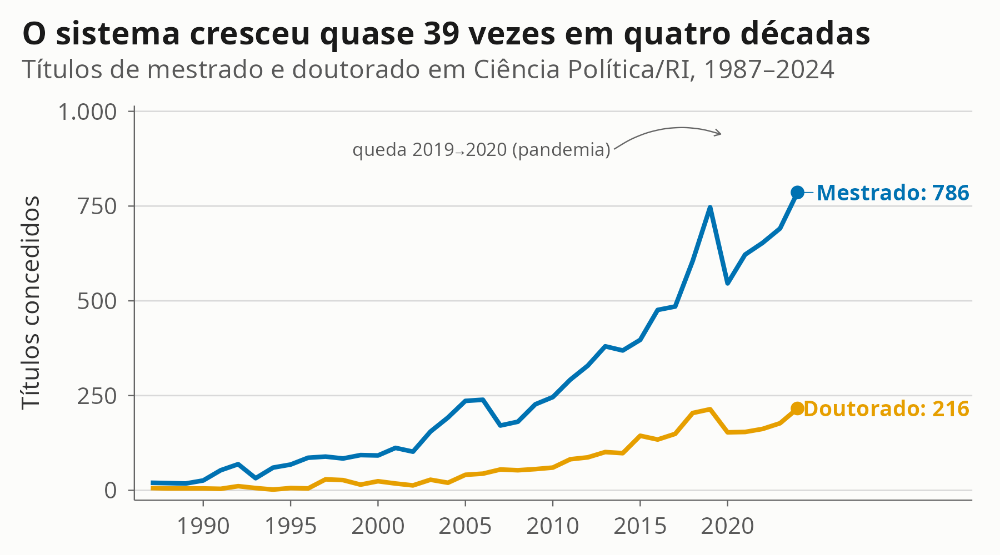
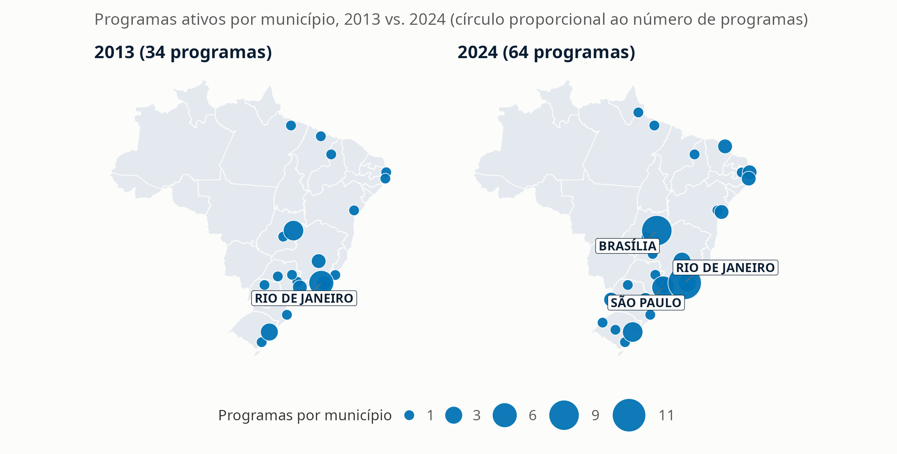
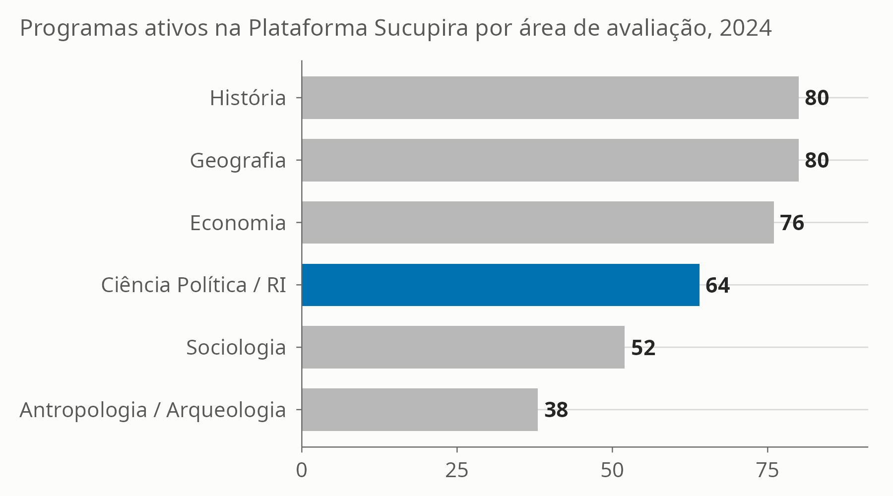
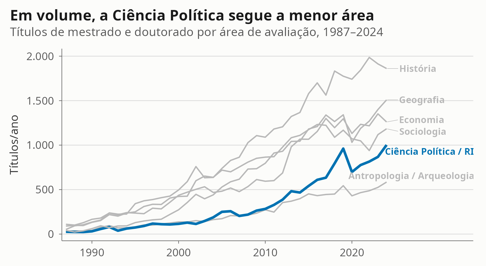
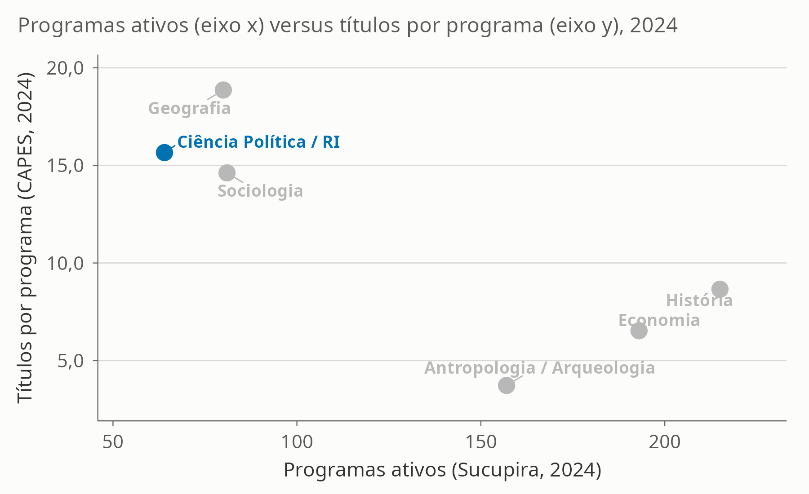
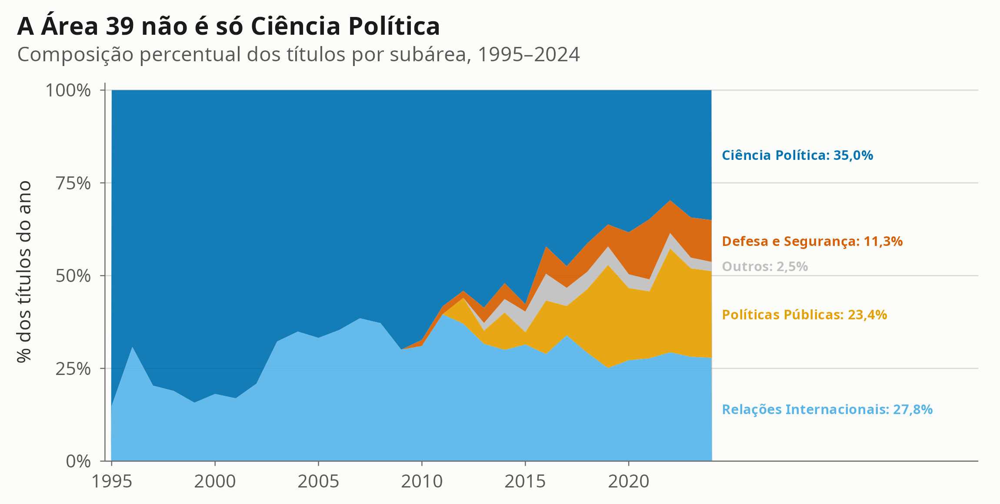
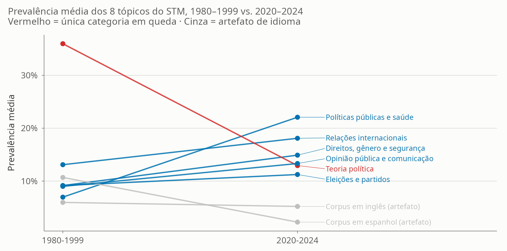
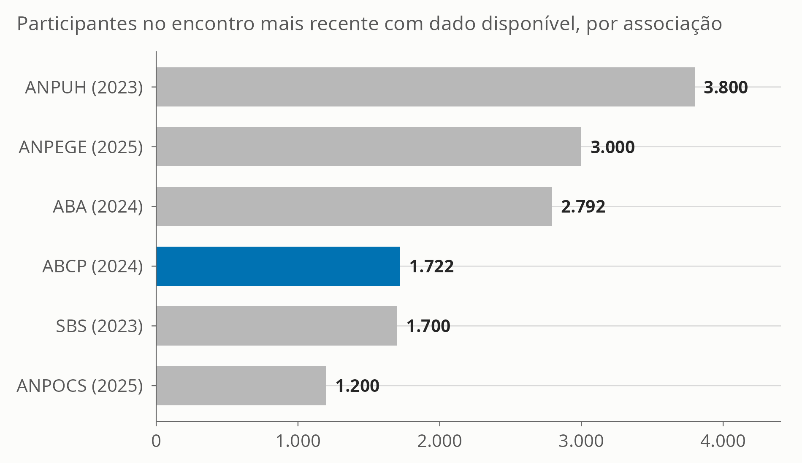

```{r setup, include=FALSE}
source(here::here("SCRIPTS", "00_setup.R"))

v_temp <- readRDS(here::here("DADOS", "processed", "valores_inline_temporal.rds"))
v_geo  <- readRDS(here::here("DADOS", "processed", "valores_inline_geografia.rds"))
v_sub  <- readRDS(here::here("DADOS", "processed", "valores_inline_subareas.rds"))
v_stm  <- readRDS(here::here("DADOS", "processed", "valores_inline_stm.rds"))
tab_temp <- readRDS(here::here("DADOS", "processed", "tabela_series_temporais.rds"))
comp_ind <- read_csv(here::here("TABELAS", "tabela_comparacao_painel_integrado.csv"), show_col_types = FALSE)
comp_2024 <- comp_ind %>% filter(ano == max(ano, na.rm = TRUE))
comp_metricas <- read_csv(here::here("TABELAS", "tabela_comparacao_metricas_capes.csv"), show_col_types = FALSE)
grau_ano <- readRDS(here::here("DADOS", "processed", "capes_titulos_por_grau_ano.rds"))
```

## A Trajetória da Ciência Política no Brasil {background-color="#0B1E33"}

::: {style="color:#F2F2F2;"}
**Institucionalização, expansão da pós-graduação e diversificação temática**

Vitor Peixoto — UENF · `r format(Sys.Date(), "%B de %Y")`

Fontes: Catálogo CAPES (1987–2024) · Plataforma Sucupira (2013–2024) · OpenAlex (1977–2024)
:::

## Sessenta anos depois, quanto do que chamamos de "expansão da Ciência Política" é, de fato, Ciência Política?

A Área 39 da CAPES também abriga Relações Internacionais, Políticas Públicas e Defesa e Segurança.

Este é um retrato empírico do sistema de pós-graduação da área — sem transformar crescimento observado em efeito causal de nenhuma política específica.

::: {.notes}
Slide de abertura conceitual. O ponto a plantar: a narrativa corrente de expansão pode estar, em boa parte, contando a história de campos limítrofes.
:::

## O sistema cresceu quase 39 vezes em quatro décadas

{width=92%}

::: {.notes}
26 títulos em 1987 → 1.002 em 2024. A queda de 2019 para 2020 (961 → 699) é provavelmente efeito da pandemia sobre o calendário de defesas e de registro, não uma reversão da tendência — a série se recupera nos anos seguintes.
:::

## …e se espalhou pelo território

{width=92%}

Municípios com programas: `r v_geo$n_municipios_2013` (2013) → `r v_geo$n_municipios_2024` (2024). Participação do Sudeste: `r fmt_num(v_geo$pct_sudeste_2013)`% → `r fmt_num(v_geo$pct_sudeste_2024)`%.

::: {.notes}
Desconcentração relativa, não reversão: o Sudeste segue como a maior região. Os maiores polos municipais permanecem Rio de Janeiro, Brasília e São Paulo.
:::

## Mas é o menor sistema das ciências sociais

{width=90%}

::: {.notes}
Em número de programas ativos na Sucupira em 2024, a Área 39 é a menor das seis áreas comparadas (Geografia, Economia, Sociologia, Antropologia/Arqueologia, História).
:::

## Em volume, a distância às áreas irmãs é grande — mas o ritmo de crescimento foi o maior de todas

::: columns
::: {.column width="60%"}
{width=98%}
:::
::: {.column width="40%"}
**1987 → 2024, crescimento relativo:**

- Ciência Política/RI: **`r fmt_num(comp_metricas$crescimento_relativo[comp_metricas$area_nome=="Ciência Política / RI"]*100, 0)`%**
- Geografia: `r fmt_num(comp_metricas$crescimento_relativo[comp_metricas$area_nome=="Geografia"]*100, 0)`%
- História: `r fmt_num(comp_metricas$crescimento_relativo[comp_metricas$area_nome=="História"]*100, 0)`%
- Sociologia: `r fmt_num(comp_metricas$crescimento_relativo[comp_metricas$area_nome=="Sociologia"]*100, 0)`%
- Antropologia: `r fmt_num(comp_metricas$crescimento_relativo[comp_metricas$area_nome=="Antropologia / Arqueologia"]*100, 0)`%
- Economia: `r fmt_num(comp_metricas$crescimento_relativo[comp_metricas$area_nome=="Economia"]*100, 0)`%

Efeito de base: partiu de **`r comp_metricas$titulos_primeiro_ano[comp_metricas$area_nome=="Ciência Política / RI"]` títulos** em 1987, o menor patamar inicial do grupo.
:::
:::

::: {.notes}
As duas leituras, escala e ritmo, são complementares — nenhuma substitui a outra. A leitura de ritmo é sensível ao ano de partida: como a área tinha uma base quase nula em 1987, qualquer crescimento posterior aparece como uma taxa relativa alta.
:::

## Pequena em escala, intensa na formação

{width=86%}

::: {.notes}
Não é um ranking de desempenho. A razão títulos/programa pode refletir composição por nível, fluxo de estudantes ou padrões de registro — não produtividade ou qualidade.
:::

## {background-color="#0B1E33"}

::: {style="color:#F2F2F2; text-align:center; padding-top:12%;"}
### O achado central
:::

## A Área 39 não é a Ciência Política {.smaller}

{width=94%}

::: {.notes .fragment}
Em 2024, apenas 35% dos títulos da Área 39 vieram de Ciência Política estrita. Relações Internacionais (27,8%), Políticas Públicas (23,4%) e Defesa e Segurança (11,3%) — um campo que não existia como categoria distinta até `r v_sub$primeiro_ano_def` — dividem o resto. Parte substancial da "expansão da Ciência Política brasileira" é, na verdade, expansão de campos limítrofes abrigados sob o mesmo sistema de avaliação.
:::

## Defesa e Segurança: um campo novo dentro da área

- Primeiro título registrado em **`r v_sub$primeiro_ano_def`**
- **`r fmt_int(v_sub$total_def)` títulos** acumulados até 2024
- **`r v_sub$n_programas_2024_def` programas ativos** em 2024 — quase metade dos 21 de Ciência Política estrita
- Reflete a hibridização da área com a *policy science* e os estudos estratégicos, não apenas crescimento do núcleo disciplinar clássico

::: {.notes}
Esse crescimento é recente e concentrado: praticamente todo ele ocorreu na década de 2010, junto com Políticas Públicas.
:::

## A agenda de pesquisa mudou

{width=94%}

::: {.fragment .notes}
Modelo STM (K=8) sobre `r fmt_int(v_stm$corpus_stm_n)` resumos, 1980–2024. Dois tópicos (T5 e T7) são artefatos de idioma — corpus em espanhol e em inglês (BPSR) — e não temas substantivos; tratados aqui como tal. Os tópicos são exploratórios: o resultado é um mapa, não uma medida definitiva, e pede validação por leitura humana de documentos de alta prevalência.
:::

## Os encontros acompanham a escala do sistema

{width=88%}

::: {.notes}
A ABCP (1996) chegou quatro décadas depois de associações como a ANPUH (1961) e a ANPOCS (1977) — cronologia consistente com a menor capilaridade histórica da área. A comparação usa a métrica de participantes na edição mais recente disponível para cada associação; os anos não coincidem entre associações.
:::

## O que isto não mostra

1. **Mudança metodológica**: descrevemos diversificação *temática*, não desenhos de pesquisa. Uma extensão futura deve classificar explicitamente os métodos usados nos trabalhos.
2. **Comparabilidade perfeita**: áreas de avaliação da CAPES não são disciplinas; os dois layouts históricos do catálogo (1987–2012 e 2013–2024) exigiram âncoras de filtro distintas; a cobertura do OpenAlex é desigual entre periódicos.
3. **Dados ausentes**: sem sexo/gênero nos microdados docentes; sem trajetória completa dos egressos; sem comparação de colaboração internacional entre áreas.

::: {.notes}
A data de defesa está presente em todos os registros do layout 2013+ e é usada como referência do ano da série.
:::

## Conclusão

1. **Escala pequena, ritmo alto.** A Área 39 segue o menor sistema de pós-graduação das ciências sociais em 2024 — mas cresceu mais rápido que todas as áreas irmãs desde 1987, partindo de uma base quase nula.
2. **A área é híbrida.** Só `r fmt_num(v_sub$pct_cp_2024)`% dos títulos de 2024 vêm de Ciência Política estrita; o resto é Relações Internacionais, Políticas Públicas e um campo novo — Defesa e Segurança — que não existia como categoria até `r v_sub$primeiro_ano_def`.
3. **A agenda mudou.** Teoria Política perdeu espaço; políticas públicas, relações internacionais, direitos e opinião pública ganharam.

Sessenta anos depois da criação dos primeiros programas, o retrato é de uma disciplina pequena, mas em expansão consistente e cada vez mais diversa — sem que isso permita atribuir o crescimento a uma política específica.

::: {.notes}
Fechamento: reforçar que os três achados são descritivos, não causais, e que a comparação institucional é uma leitura complementar entre si (nenhuma substitui a outra).
:::

## {background-color="#0B1E33"}

::: {style="color:#F2F2F2; text-align:center; padding-top:18%;"}
### Obrigado

**Vitor Peixoto — UENF**
:::

## Reprodutibilidade

- **Repositório:** `/dados/historia_ciencia_politica_brasil`
- **Pipeline:** `SCRIPTS/01` a `SCRIPTS/17`; artigo em `artigo_historia_cp_brasil.qmd`
- **Auditoria de dados:** `AUDITORIA.md`
- **Semente aleatória:** `20260828`

### Referências citadas nesta apresentação

- Marenco, A. (2014). *The Three Achilles' Heels of Brazilian Political Science*. BPSR. [@marenco2014heels]
- Roberts, M. E. et al. (2014). *Structural Topic Models for Open-Ended Survey Responses*. AJPS. [@roberts2014stm]

::: {.notes}
Todos os números desta apresentação são inline a partir dos mesmos RDS/CSV que alimentam o artigo — sem valor digitado à mão.
:::
